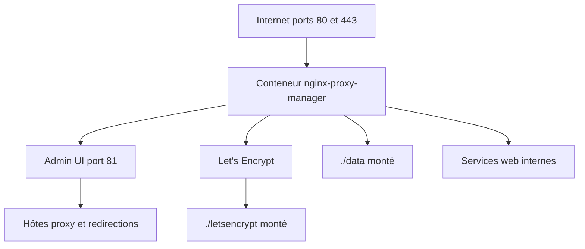

# NginxProxyManager/nginx-proxy-manager

> Image Docker qui expose des services derrière Nginx avec SSL Let's Encrypt, via une interface web.

## Le problème
Publier un service auto-hébergé demande d'écrire du Nginx et de gérer le renouvellement des certificats.
Une erreur de configuration et le site tombe, ou pire, reste en clair.

## Ce que ça fait vraiment
Image Docker préconstruite : on décrit ses hôtes de redirection, redirections, flux et pages 404 depuis une interface d'administration, sans écrire de Nginx.
SSL gratuit par Let's Encrypt, ou certificats personnalisés fournis par vous.
Listes d'accès et authentification HTTP basique par hôte ; gestion des utilisateurs, permissions et journal d'audit.
Configuration Nginx avancée disponible pour les cas que l'interface ne couvre pas — optionnelle par principe.

## Comment c'est branché


## Essayer
```yml
services:
  app:
    image: 'docker.io/jc21/nginx-proxy-manager:latest'
    restart: unless-stopped
    ports:
      - '80:80'
      - '81:81'
      - '443:443'
    volumes:
      - ./data:/data
      - ./letsencrypt:/etc/letsencrypt
```

```bash
docker compose up -d
```

## Coût et pièges
Gratuit. Le coût est l'exposition : il faut ouvrir 80 et 443 sur la box et pointer un nom de domaine (DuckDNS, Route53, Cloudflare).
`armv7` n'est plus supporté à partir de la version 2.14 ; rester sur le tag `2.13.7` dans ce cas.

## Ce que ce n'est pas
Ce n'est pas un WAF ni une protection anti-DDoS : c'est un reverse proxy avec terminaison TLS.
Ce n'est pas fait pour les configurations Nginx complexes : le projet revendique la simplicité comme objectif, les options avancées restent un échappatoire.
Ce n'est pas sans surface d'attaque : l'interface d'administration sur le port 81 doit rester protégée.

## Alternatives
Aucune alternative n'est nommée dans le README.

## Pour toi
Le raccourci évident pour exposer proprement tes services perso ou un serveur de démos ; rien à apprendre.
