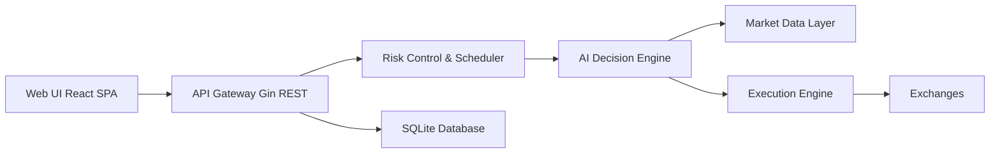

# NoFxAiOS/nofx

> Terminal de trading crypto où un LLM décide, sous garde-fous de risque codés en Go.

## Le problème
Laisser un LLM trader sans limites expose à des pertes ; il faut une couche de risque hors de portée du modèle.

## Ce que ça fait vraiment
Boucle continue : lecture du marché, décision par LLM, exécution, enregistrement du raisonnement.
Limites codées : positions max, plafonds de levier, stop-loss côté exchange, clôture sur drawdown, cooldowns, mode sûr.
Neuf exchanges (Binance, Bybit, OKX, Hyperliquid…), huit fournisseurs LLM ou paiement à l'appel via Claw402 (USDC).
Tableau de bord, studio de stratégies, classement public.

## Comment c'est branché


## Essayer
```bash
curl -fsSL https://raw.githubusercontent.com/NoFxAiOS/nofx/main/install.sh | bash
docker compose -f docker-compose.prod.yml up -d
```

## Coût et pièges
Argent réel : dépôt USDC de frais IA et fonds sur exchange ; liens d'inscription affiliés. Pertes possibles.

## Ce que ce n'est pas
Pas un outil de backtest rigoureux ni un conseil financier ; décisions alimentées par la pile de données Claw402/Vergex.

## Alternatives
Aucune alternative nommée dans le README.

## Pour toi
À ignorer : le motif « le modèle propose, le runtime tranche » est instructif, mais le produit engage de l'argent réel via un SaaS affilié.
