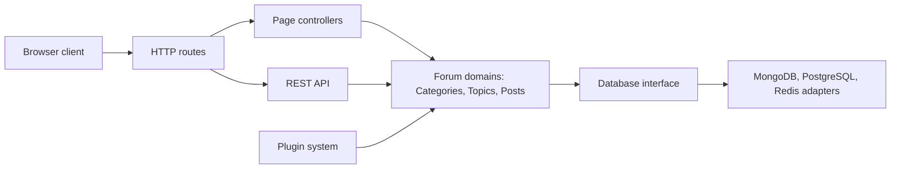

# NodeBB/NodeBB

> Logiciel de forum auto-hébergé sous Node.js, avec notifications temps réel, pour qui veut sa propre communauté en ligne.

## Le problème
Héberger une communauté de discussion sans dépendre d'une plateforme tierce ni d'un vieux logiciel de forum sans temps réel.

## Ce que ça fait vraiment
Forum à catégories, comptes locaux, messagerie privée et groupes. Il expose une API REST en lecture/écriture et des WebSockets pour les échanges instantanés. Le cœur est minimal : le reste passe par des plugins tiers et des thèmes (thème « Harmony », Bootstrap 5). Il tourne sur MongoDB, Redis ou PostgreSQL. Une fédération ActivityPub optionnelle est mentionnée dans l'architecture décrite d'après le code.

## Comment c'est branché


## Essayer
```bash
docker-compose up
```
Le README indique ensuite http://localhost:4567. Il précise que NodeBB n'est pas lancé par `npm start` (installation en CLI).

## Coût et pièges
Gratuit, mais Node.js 22+ et MongoDB 5+ ou Redis 7.2+ à installer ; Redis obligatoire en cluster. Le README avertit que Redis écoute par défaut sur toutes les interfaces : à restreindre (`bind_address`, `requirepass`, pare-feu).

## Ce que ce n'est pas
Ce n'est pas un outil data/IA : c'est une application web communautaire. Les fonctions au-delà du socle dépendent de plugins tiers. Une offre d'hébergement « premium » existe, sans que le README en donne le prix.

## Alternatives
Aucune alternative nommée dans le README.

## Pour toi
Ignorer : un forum auto-hébergé est hors périmètre data/IA/MLOps, et la licence GPL-3.0 impose le partage des modifications distribuées.

