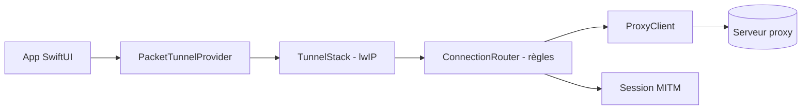

# NodePassProject/Anywhere

> Client proxy natif pour iOS, iPadOS et tvOS, écrit en Swift avec sa propre pile réseau.

## Le problème
Les clients proxy iOS enveloppent souvent sing-box ou Xray-core via un pont Go ou C++.

## Ce que ça fait vraiment
Une application Swift avec une extension réseau (tunnel de paquets) qui implémente sans pile tierce : TLS (empreintes de navigateur, Reality, ECH), QUIC (ngtcp2), routage à cinq niveaux, DNS Fake-IP et interception HTTPS (MITM) réécrivant le trafic par règles ou JavaScript. Protocoles : Nowhere, VLESS, Hysteria2, Sudoku, Trojan, AnyTLS, Shadowsocks, SOCKS5, RFC. Cibles : iOS, iPadOS, tvOS, watchOS, contrôles du Centre de contrôle et synchro iCloud.

## Comment c'est branché

## Essayer
Aucune commande dans le README. Usage documenté par liens : `anywhere://add-proxy?link=<link>` et `anywhere://add-rule-set?link=<url>` pour importer un proxy ou des règles.

## Coût et pièges
Il faut un serveur proxy existant. Le MITM génère une autorité racine : à manier avec précaution. La licence GPL-3.0 ne couvre pas le nom ni l'icône « Anywhere » : à remplacer en cas de fork.

## Ce que ce n'est pas
Ce n'est pas un service de VPN ni un serveur proxy. Le qualificatif « meilleur client » du README relève de l'auteur, sans comparaison.

## Alternatives
sing-box et Xray-core, cités comme les clients que celui-ci évite d'envelopper.

## Pour toi
À ignorer : client réseau iOS sans lien avec la data ou le MLOps, avec des usages de contournement et d'interception sensibles.

