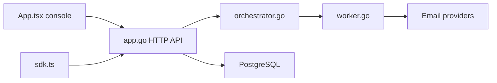

# Notifuse/notifuse

> Plateforme auto-hébergée d'e-mailing, de transactionnel et d'automatisations, alternative à Mailchimp ou Brevo.

## Le problème
Les outils d'e-mailing facturent à l'envoi et gardent tes données chez eux.

## Ce que ça fait vraiment
Console React et API Go sur PostgreSQL : éditeur visuel MJML, campagnes, tests A/B, segmentation, parcours d'automatisation (délais, branches, webhooks), API transactionnelle, modèles Liquid. Envoi via SES, Mailgun, Postmark, Mailjet, SparkPost, SendGrid ou SMTP. Analytique web sans cookie intégrée, gestionnaire de fichiers S3, centre de notifications. Une offre cloud à partir de 16 $/mois existe.

## Comment c'est branché


## Essayer
```bash
# Aucune commande exacte dans ce README : assistant d'installation interactif
# et documentation externe ; fichier compose.alloydb.yaml pour AlloyDB Omni.
```

## Coût et pièges
Il faut un fournisseur d'envoi (coût à ta charge), PostgreSQL 17+, une base GeoLite2 incluse. La licence n'est pas identifiée par GitHub : à vérifier.

## Ce que ce n'est pas
Pas une messagerie : il envoie via un fournisseur tiers. Le tarif de l'offre hébergée est celui du README, sans garantie.

## Alternatives
Listmonk, Mailchimp, Brevo, Mailjet (cités comme équivalents).

## Pour toi
À surveiller : intéressant pour envoyer des alertes ou newsletters de ta plateforme, après avoir confirmé la licence.

