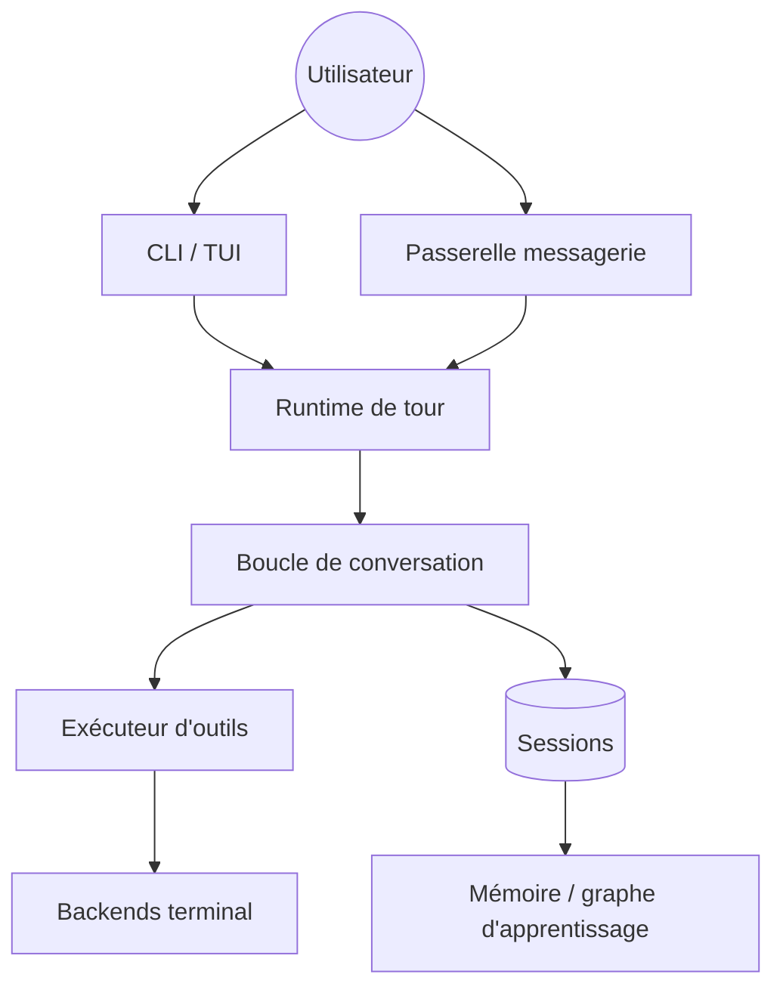

# NousResearch/hermes-agent

> Agent personnel en terminal ou en messagerie, hébergeable sur un VPS, pour bricoleurs autonomes.

## Le problème
Un agent lié au laptop meurt quand le laptop se ferme, et repart sans mémoire à chaque session.
Le faire tourner ailleurs et le joindre depuis un téléphone demande d'assembler soi-même la plomberie.

## Ce que ça fait vraiment
TUI complet plus une passerelle unique vers Telegram, Discord, Slack, WhatsApp, Signal et e-mail.
Crée des skills à partir de ses propres exécutions, les révise à l'usage, cherche dans ses sessions passées.
Sept backends d'exécution : local, Docker, SSH, Singularity, Modal, Daytona, Vercel Sandbox.
Ordonnanceur cron intégré, sous-agents isolés, génération de trajectoires pour l'entraînement.

## Comment c'est branché


## Essayer
```bash
curl -fsSL https://hermes-agent.nousresearch.com/install.sh | bash
hermes
hermes model
hermes doctor
```

## Coût et pièges
Les modèles sont à ta charge (OpenRouter, OpenAI, endpoint perso) ou via l'abonnement Nous Portal.
L'installateur télécharge uv, Python 3.11, Node, ripgrep, ffmpeg ; l'antivirus Windows flague `uv.exe`.

## Ce que ce n'est pas
Pas un service géré : la sécurité du VPS, des cookies et des clés reste à ta charge.
Le README ne déclare aucune licence — à vérifier avant tout usage professionnel.
La boucle d'apprentissage est une heuristique de prompts, pas un entraînement de modèle.

## Alternatives
- `ollama/ollama` : si le besoin est de servir un modèle local, pas d'avoir un assistant permanent.
- `OpenHands/OpenHands` : même idée d'agent auto-hébergé, orientée code plutôt qu'assistant.

## Pour toi
Intéressant comme banc d'essai d'un agent persistant ; trop jeune pour porter un pipeline de prod.
