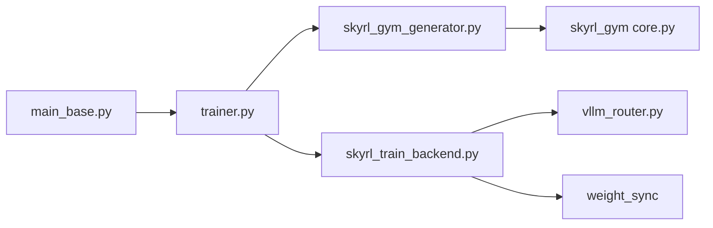

# NovaSky-AI/SkyRL

> Bibliothèque d'apprentissage par renforcement pour LLM, de l'entraînement aux environnements et agents.

## Le problème
Entraîner des LLM par RL demande d'assembler entraînement distribué, inférence pour les rollouts, environnements et synchronisation des poids.

## Ce que ça fait vraiment
Monorepo Python : `skyrl` (entraînement RL, SFT, compatibilité API Tinker), `skyrl-gym` (environnements math, code, recherche, SQL en API Gymnasium) et `skyrl-agent` (agents longue durée). Le trainer s'appuie sur FSDP ou Megatron, des serveurs d'inférence vLLM et une synchronisation des poids ; un mode asynchrone découple rollouts et entraînement. Ray, PyTorch/CUDA et vLLM sont sous-jacents.

## Comment c'est branché


## Essayer
Le README ne fournit aucune commande : il renvoie aux documents de démarrage (quickstart, Development Guide).
```bash
# aucune commande documentée dans le README
```

## Coût et pièges
Matériel GPU nécessaire ; installation non détaillée dans le README. 471 issues ouvertes : dépôt actif mais en mouvement.

## Ce que ce n'est pas
Pas une solution clé en main : c'est un cadre d'entraînement pour équipes qui ont des GPU. Le lien avec Tinker est une compatibilité d'API, pas un service.

## Alternatives
- veRL : cité comme backend de `skyrl-agent`.

## Pour toi
Surveiller : pertinent si tu fais du RL sur LLM avec tes propres GPU ; sans GPU, rien à en tirer.
