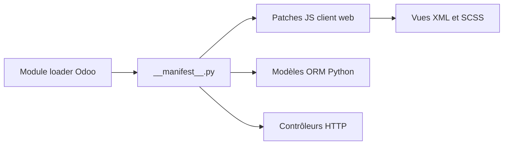

# OCA/web

> Collection d'add-ons Odoo 18 qui améliorent l'interface web : thèmes, widgets, vues, notifications.

## Le problème
L'interface standard d'Odoo manque de petites fonctions du quotidien (mode sombre, colonnes mémorisées, liens cliquables).

## Ce que ça fait vraiment
Le README est un tableau d'une soixantaine de modules `web_*` (dark mode, timeline, pivot calculé, chatter, PWA, fermeture de session inactive, restriction d'export). Chaque module est un add-on indépendant avec son manifeste, du Python, des vues XML et des assets JS/SCSS.

## Comment c'est branché

## Essayer
Aucune commande documentée dans le README.

## Coût et pièges
Il faut une instance Odoo 18 : la version de chaque add-on commence par 18.0. AGPL-3.0. Certains embarquent des bibliothèques JS (vis-timeline, d3, fuse). 266 issues ouvertes.

## Ce que ce n'est pas
Ce n'est pas une application : chaque module s'installe à part dans Odoo.

## Alternatives
Aucune alternative nommée dans le README.

## Pour toi
Ignorer : ergonomie d'Odoo, sans lien avec un flux data ou IA, sauf si Odoo est ton ERP.

