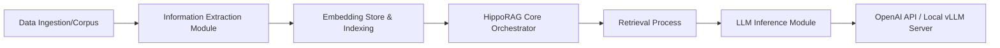

# OSU-NLP-Group/HippoRAG

> Cadre de mémoire à long terme pour LLM, fondé sur un graphe de connaissances, pour chercheurs et ingénieurs RAG.

## Le problème
Un RAG classique retrouve des passages isolés et peine sur les questions multi-sauts ou sur la synthèse de contextes longs.

## Ce que ça fait vraiment
`HippoRAG` indexe des documents : extraction d'informations ouverte (OpenIE) par un LLM, construction d'un graphe d'entités et de faits, stockage des embeddings (Parquet par défaut, ou Qdrant, ChromaDB, Milvus). À la requête, la récupération suit le graphe puis `rag_qa` répond. Les LLM possibles : OpenAI, Azure, Bedrock (LiteLLM), OrcaRouter, ou un serveur vLLM local. L'auteur annonce un coût d'indexation inférieur à GraphRAG, RAPTOR et LightRAG, sans chiffre dans le README.

## Comment c'est branché


## Essayer
```bash
conda create -n hipporag python=3.10
conda activate hipporag
pip install hipporag
export OPENAI_API_KEY=<your openai api key>
python main.py --dataset sample --llm_base_url https://api.openai.com/v1 --llm_name gpt-4o-mini --embedding_name nvidia/NV-Embed-v2
```

## Coût et pièges
L'indexation appelle un LLM sur tout le corpus : coût d'API ou GPU. Un index créé sans `index_manifest.json`, ou avec une configuration différente, est rejeté : il faut réindexer dans un nouveau `save_dir`. Les endpoints compatibles OpenAI doivent renvoyer les données `usage`, sinon HippoRAG refuse la réponse. Version 2.0.0a5 : alpha.

## Ce que ce n'est pas
Ce n'est pas un moteur de recherche prêt à déployer : c'est du code de recherche (NeurIPS 2024, ICML 2025) avec un script de reproduction. Les résultats du README sont ceux des auteurs, sur leurs jeux de données.

## Alternatives
- GraphRAG : référence des RAG à graphe, plus lourd à indexer selon le README.
- LightRAG : autre RAG à graphe, comparé par les auteurs.
- RAPTOR : RAG hiérarchique, comparé de la même façon.

## Pour toi
À surveiller : pertinent si tu compares des RAG à graphe sur du multi-saut, mais alpha, coûteux à indexer et sans garantie hors de l'évaluation des auteurs ; essaie sur un petit corpus.
