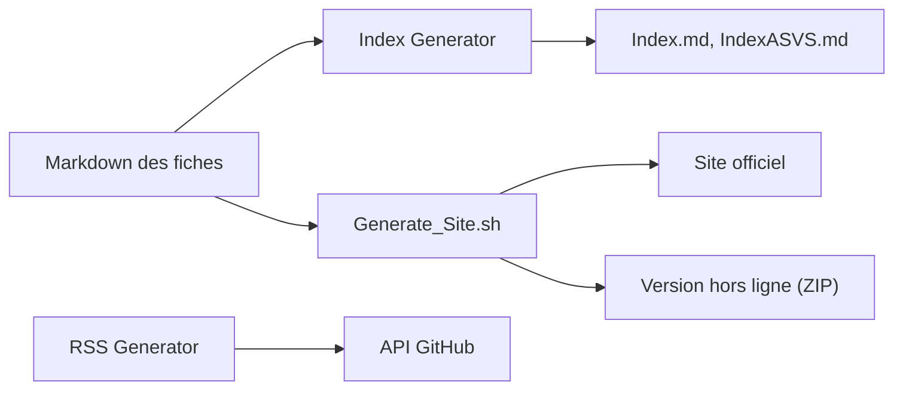

# OWASP/CheatSheetSeries

> Fiches de bonnes pratiques de sécurité applicative de l'OWASP, à lire sur le site officiel.

## Le problème
Les développeurs cherchent des pratiques de sécurité fiables, dispersées entre blogs et normes, sans référence concise par sujet.

## Ce que ça fait vraiment
Le dépôt contient les sources Markdown des fiches, des index (alphabétique, ASVS, MASVS, Proactive Controls) et des scripts qui génèrent le site officiel et une version hors ligne. Un script produit aussi un flux RSS à partir de données de pull requests GitHub. Le README précise que les fichiers Markdown ne sont pas à citer : la référence est le site.

## Comment c'est branché


## Essayer
```bash
make install-python-requirements
make generate-site
make serve
npm run lint-markdown
```

## Coût et pièges
Gratuit. Licence CC-BY-SA-4.0 : attribution et partage à l'identique si tu réutilises le texte. Les fichiers du dépôt ne sont pas la version citable.

## Ce que ce n'est pas
Ce n'est pas un outil d'audit ni un scanner : ce sont des textes de recommandations. Aucune garantie de couverture pour les usages IA/ML : le README ne le mentionne pas.

## Alternatives
Aucune alternative citée dans le README.

## Pour toi
À adopter comme référence de sécurité pour tes API et pipelines : gratuit, maintenu par une fondation, et directement applicable en revue de code.

