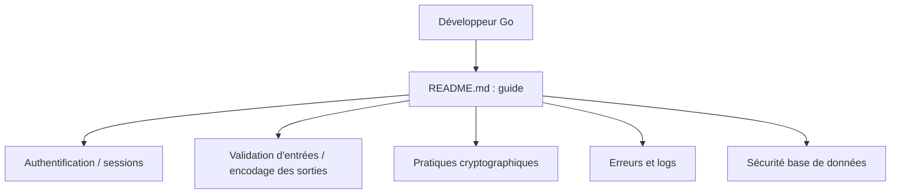

# OWASP/Go-SCP

> Un livre de bonnes pratiques de codage sécurisé en Go pour applications web, à lire par les développeurs.

## Le problème
Écrire du Go web sans savoir quelles erreurs de sécurité guettent : validation d'entrées, sessions, crypto, erreurs.

## Ce que ça fait vraiment
C'est un livre, pas du code exécutable. Il suit chapitre par chapitre le guide OWASP Secure Coding Practices (Quick Reference v2) et l'illustre avec des exemples Go. Il est disponible en PDF, Mobi et ePub. Créé par l'équipe Checkmarx, puis donné à la fondation OWASP.

## Comment c'est branché

Le graphe fourni ne prouve aucun appel entre chapitres : ce sont des thèmes de lecture.

## Essayer
```bash
# Aucune commande documentée : le README propose seulement de télécharger le livre (PDF, Mobi, ePub).
```

## Coût et pièges
Gratuit. Dernier push en mai 2024 : le contenu suit le Quick Reference v2 et peut avoir vieilli côté versions de Go et bibliothèques.

## Ce que ce n'est pas
Ni une bibliothèque, ni un outil d'analyse. Il ne détecte rien dans votre code. Licence CC-BY-SA : partage à l'identique si vous réutilisez le texte.

## Alternatives
- OWASP Secure Coding Practices Quick Reference Guide : la checklist indépendante du langage, dont ce livre est l'adaptation.

## Pour toi
À surveiller : utile comme référence si tu écris des services Go (API de modèles, outils MLOps), mais figé depuis 2024 et sans exécution possible.

