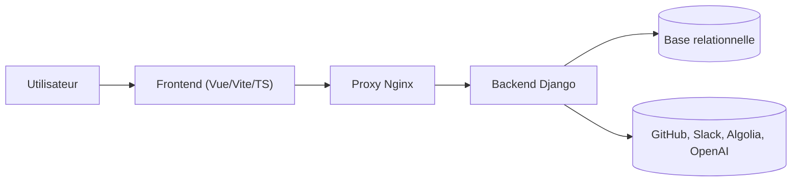

# OWASP/Nest

> Plateforme communautaire pour explorer les projets OWASP et trouver où contribuer, avec bot Slack et synthèses IA.

## Le problème
S'orienter parmi les nombreux projets, chapitres et issues OWASP est difficile pour un nouveau contributeur.

## Ce que ça fait vraiment
Propose la recherche de projets et d'issues, une page de proximité des chapitres, un bot Slack (NestBot) et des résumés générés par IA. D'après le code : backend Django modulaire (apps `core`, `github`, `owasp`, `slack`, `common`), frontend Vue/TypeScript, appels à GitHub, Slack, Algolia et OpenAI, déploiement Docker Compose et Ansible.

## Comment c'est branché

## Essayer
Le README ne donne aucune commande : il renvoie à la documentation externe (DeepWiki, ReadTheDocs).

## Coût et pièges
Le backend appelle OpenAI et Algolia (comptes et clés à ta charge) et GitHub/Slack. Déploiement multiconteneur. 460 issues ouvertes.

## Ce que ce n'est pas
Ce n'est pas un outil de sécurité : c'est un portail de contribution communautaire.

## Alternatives
Le README ne cite aucune alternative.

## Pour toi
À surveiller : architecture concrète d'une app Django avec recherche, bot Slack et résumés IA, utile comme référence si tu contribues à OWASP.

