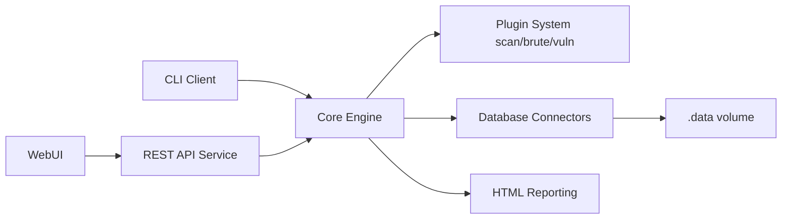

# OWASP/Nettacker

> Framework Python d'audit réseau automatisé, pour professionnels de la sécurité qui testent des systèmes qu'ils ont le droit d'auditer.

## Le problème
Cartographier hôtes, ports, sous-domaines et services d'un périmètre à la main est long et peu répétable. Sans historique, on ne voit pas ce qui a changé d'un audit à l'autre.

## Ce que ça fait vraiment
Chaque tâche (scan de ports, découverte de services, énumération de sous-domaines, vérifications de vulnérabilités, tests d'identifiants) est un module YAML chargé par un moteur commun, multithread. Cibles : IP, plages, CIDR, domaines, URL. Les résultats vont en base (SQLite par défaut, MySQL/PostgreSQL possibles) et en rapports HTML, JSON, CSV ou texte. Une comparaison avec les scans précédents sert à repérer les dérives. Usage strictement réservé aux systèmes dont on a l'autorisation écrite, le README le rappelle en tête.

## Comment c'est branché


## Essayer
```bash
docker run owasp/nettacker -i 192.168.0.1 -m port_scan
docker run owasp/nettacker --help
docker-compose up
```

## Coût et pièges
Gratuit, image Docker disponible. La clé d'API du mode Web s'affiche dans la console (`docker logs nettacker_nettacker`). Aucun scan sans consentement du propriétaire de la cible : responsabilité légale de l'opérateur.

## Ce que ce n'est pas
Ni un outil de data science ni un outil de supervision continue : c'est un scanner d'audit. Le README mentionne aussi des options de discrétion (délais, proxy) qui rendent le cadre légal d'autant plus important. 248 issues ouvertes.

## Alternatives
Aucune alternative nommée dans le README.

## Pour toi
Surveiller : utile seulement si tu audites ta propre infra ML exposée (dérive de ports en CI/CD), hors du cœur data/IA sinon.

