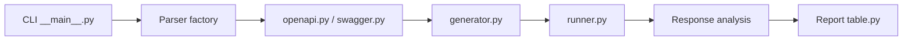

# OWASP/OFFAT

> Testeur de sécurité d'API qui génère ses tests depuis une spécification OpenAPI, pour équipes qui auditent leurs propres API.

## Le problème
Vérifier à la main qu'une API respecte les bonnes pratiques OWASP est long et répétitif, endpoint par endpoint.

## Ce que ça fait vraiment
- Lit une spécification Swagger v2 ou OpenAPI v3 et génère des tests, avec données fournies via un fichier YAML.
- Exécute les requêtes en asynchrone et analyse les réponses (méthodes HTTP restreintes, exposition de données, contrôle d'accès, injections de base, etc.).
- Produit un rapport en tableau ; disponible en CLI, en API d'automatisation et en Docker.

## Comment c'est branché


## Essayer
```bash
python -m pip install offat
offat -f swagger_file.json
```

## Coût et pièges
Gratuit, licence MIT. À lancer uniquement sur des API que tu possèdes ou pour lesquelles tu as une autorisation écrite : les tests envoient de vraies requêtes. Les options détaillées sont renvoyées au README complet.

## Ce que ce n'est pas
Ce n'est pas un audit complet : seule une partie de l'OWASP API Top 10 est couverte. La colonne « résultat » peut indiquer un succès même en présence d'une fuite de données (le README le précise).

## Alternatives
Aucune alternative nommée dans le README.

## Pour toi
À surveiller : pratique pour tester en CI les API qui servent tes modèles, tant que tu l'utilises sur tes propres environnements ; la couverture partielle impose de le compléter.

