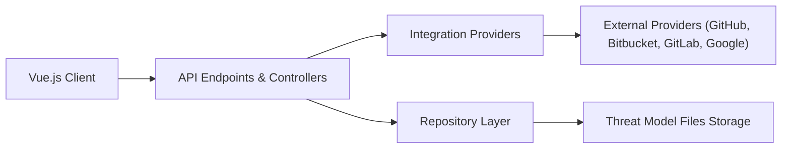

# OWASP/threat-dragon

> Application de modélisation des menaces : dessiner un diagramme de flux et lister les menaces par élément.

## Le problème
Modéliser les menaces d'un système se fait dans des tableurs ou des schémas épars, sans lien entre diagramme et liste de risques.

## Ce que ça fait vraiment
Éditeur de diagrammes de flux de données (Vue.js) avec suggestion de menaces et saisie des mesures d'atténuation. Version web (serveur Node/Express) qui stocke les modèles en local ou dans GitHub, GitLab, Bitbucket, GitHub Enterprise ; version bureau pour Windows, macOS, Linux sans dépôt externe. Projet OWASP au statut « Production », branche 1.x en maintenance seulement.

## Comment c'est branché


## Essayer
```bash
git clone https://github.com/owasp/threat-dragon.git
npm install
npm start
docker run -it --rm -p 8080:3000 -v $(pwd)/.env:/app/.env threatdragon/owasp-threat-dragon:v2.2.0
```
Puis http://localhost:8080/.

## Coût et pièges
Gratuit ; variables d'environnement à configurer, et enregistrement d'une application OAuth pour accéder à GitHub, GitLab ou Bitbucket. Le tag `latest` peut être une version de développement : préférer `stable`.

## Ce que ce n'est pas
Pas un scanner de vulnérabilités : il structure la réflexion, il ne détecte rien.

## Alternatives
Aucune alternative nommée dans le README.

## Pour toi
À surveiller : utile pour documenter les risques d'un système ML ou d'une plateforme de données, mais outil d'analyse de sécurité, pas d'ingénierie data.

