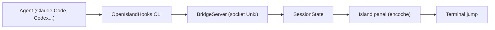

# Octane0411/open-vibe-island

> Application macOS locale, dans l'encoche ou la barre du haut, qui suit et pilote vos agents de code.

## Le problème
Avec plusieurs agents de code ouverts dans des terminaux, on perd la trace de leur état, des demandes de permission et de la bonne fenêtre où revenir.

## Ce que ça fait vraiment
Les hooks des agents (Claude Code, Codex, Cursor, Gemini CLI, OpenCode, Kimi, Grok, Pi…) appellent un petit CLI, `OpenIslandHooks`, qui envoie du JSON sur un socket Unix à un `BridgeServer` dans l'app. L'état des sessions est réduit par `SessionState.apply` et affiché dans l'overlay ; un clic ramène au bon terminal ou IDE. Il lit aussi les fenêtres d'usage 5 h et 7 jours de Claude et de Codex. Les hooks échouent en mode ouvert : sans l'app, les agents continuent.

## Comment c'est branché


## Essayer
```bash
brew install --cask open-island
git clone https://github.com/Octane0411/open-vibe-island.git
swift run OpenIslandSetup install
```

## Coût et pièges
Gratuit, sans télémétrie ni compte selon le README. macOS 14 minimum ; la compilation demande Swift 6.2 et Xcode. L'installation modifie les fichiers de config des agents (`~/.claude/settings.json`, `~/.codex/config.toml`…). GPL-3.0.

## Ce que ce n'est pas
Pas une couche d'orchestration : il observe et redirige, sans lancer les agents. L'usage de Claude Desktop n'alimente pas seul le panneau d'usage. Sur macOS uniquement. 208 issues ouvertes.

## Alternatives
- Vibe Island : version fermée et payante dont il se veut l'équivalent libre.

## Pour toi
À surveiller : utile si tu jongles entre plusieurs agents de code sur Mac, mais ses hooks touchent tes configs d'agents, donc à tester d'abord.

