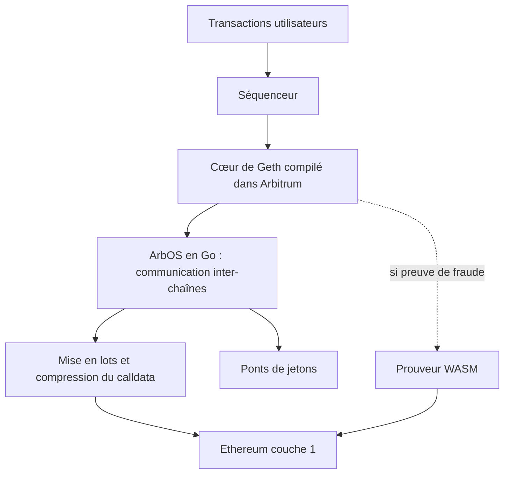

# OffchainLabs/nitro

> **One sentence.** Arbitrum's node software: an optimistic layer 2 rollup that runs Geth on top of Ethereum.

## The problem

Running a layer 2 chain on Ethereum means having an execution engine, a sequencer, token bridges
and fraud proofs. Without an integrated stack, each piece has to be written and made provable by
hand, historically with a custom language and compiler.

## What it actually does

- Ships a complete optimistic layer 2 rollup stack: fraud proofs, the sequencer, token bridges
  and calldata compression.
- Compiles the core of Geth, the Ethereum client, straight into Arbitrum, replacing the custom
  EVM emulator used by earlier Arbitrum versions.
- Runs a prover that replays Arbitrum's interactive fraud proofs over WASM code: native
  execution in normal operation, switching to WASM when a proof is required.
- Includes ArbOS, rewritten in Go, covering cross-chain communication plus the batching and
  compression system meant to cut layer 1 costs.
- Exposes the active ArbOS version through the `arbOSVersion()` method on the `ArbSys`
  precompile.

## How it is wired

The pieces as the README describes them: Geth at layer 2, ArbOS around it, and the WASM prover as
the fallback path when a fraud proof is demanded.



## Trying it

The only commands in the README cover setting up `nitro-private`, the variant that routes
`go-ethereum` and `wasmer` through private forks.

```sh
git clone git@github.com:OffchainLabs/nitro-private.git   # no need for --recurse-submodules
cd nitro-private
make init-submodules
make check-submodules
```

## Cost and gotchas

The code is free, but the licence governs use: permissionless, cost-free deployment applies only
to a chain that settles to Arbitrum One or Arbitrum Nova. Deploying directly on Ethereum or
settling to another layer 2 falls under the Arbitrum Expansion Program, which requires
contributing 10% of net revenue back to the Arbitrum community. The support window is short: an
older minor release is supported for 30 days once a newer one exists, and only the ArbOS release
activated on mainnet Arbitrum One receives security updates. The documented clone targets a
private SSH repository, so it is unusable without access.

## What it is not

This is not an application SDK or a contracts framework: it is the node software and the chain
stack itself. It is not open source in the usual sense either — the Business Source License
carries commercial clauses, and the catalogue records the licence as undeclared. The README also
documents neither how to build the public repository nor the machine resources it needs.

## Alternatives

No comparable alternative in the catalogue: no neighbours were allowed for this batch line, and
the only other projects named in the README (Uniswap, Aave, Geth) are either DeFi applications
cited for their licence or an internal component — not competing layer 2 stacks.

## For you

Skip it as a data / AI / MLOps practitioner: nothing here touches data, models or pipeline
deployment, and the entry cost is that of running blockchain infrastructure.
