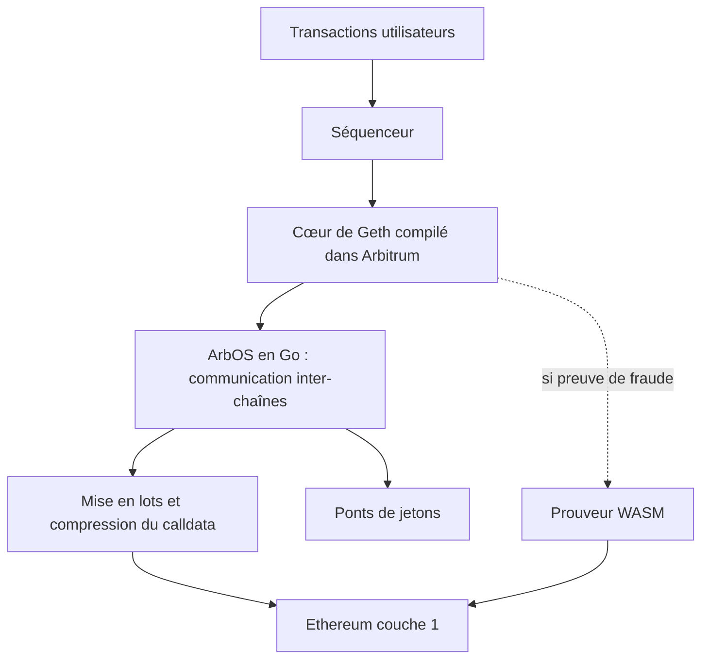

# OffchainLabs/nitro

> **Une phrase.** Le logiciel de nœud d'Arbitrum : un rollup optimiste de couche 2 qui exécute Geth au-dessus d'Ethereum.

## Le problème

Exécuter une chaîne de couche 2 sur Ethereum suppose un moteur d'exécution, un séquenceur, des
ponts de jetons et des preuves de fraude ; sans une pile intégrée, chacun de ces morceaux est à
écrire et à faire prouver soi-même, avec un langage et un compilateur sur mesure.

## Ce que ça fait vraiment

- Fournit une pile complète de rollup optimiste de couche 2 : preuves de fraude, séquenceur,
  ponts de jetons, compression du calldata.
- Embarque le cœur de Geth, le client Ethereum, compilé directement dans Arbitrum, à la place
  de l'émulateur EVM maison des versions précédentes.
- Fait tourner un prouveur qui rejoue les preuves de fraude interactives d'Arbitrum sur du code
  WASM : exécution native en temps normal, bascule en WASM si une preuve est nécessaire.
- Inclut ArbOS, réécrit en Go, qui gère la communication inter-chaînes et le système de mise en
  lots et de compression destiné à réduire les coûts sur la couche 1.
- Expose la version d'ArbOS active via la méthode `arbOSVersion()` du précompilé `ArbSys`.

## Comment c'est branché

Les pièces telles que le README les décrit : Geth au niveau 2, ArbOS autour, le prouveur WASM en
recours quand une preuve de fraude est demandée.



## Essayer

Les seules commandes du README concernent la mise en place de `nitro-private`, la variante qui
route `go-ethereum` et `wasmer` vers des forks privés.

```sh
git clone git@github.com:OffchainLabs/nitro-private.git   # no need for --recurse-submodules
cd nitro-private
make init-submodules
make check-submodules
```

## Coût et pièges

Le code est gratuit, mais la licence conditionne l'usage : déploiement permissionless et sans
coût uniquement pour une chaîne qui se règle sur Arbitrum One ou Arbitrum Nova ; un déploiement
direct sur Ethereum ou sur une autre couche 2 relève du Arbitrum Expansion Program, qui impose de
reverser 10 % du revenu net à la communauté Arbitrum. La politique de support est courte : une
version mineure n'est suivie que 30 jours après la sortie d'une plus récente, et seule la version
d'ArbOS activée sur Arbitrum One reçoit les correctifs de sécurité. Le clone documenté vise un
dépôt privé en SSH, donc inaccessible sans droits.

## Ce que ce n'est pas

Ce n'est pas un SDK applicatif ni un framework de contrats : c'est le logiciel de nœud et la pile
de chaîne elle-même. Ce n'est pas non plus du logiciel libre au sens usuel — la Business Source
License pose des clauses commerciales et le catalogue relève une licence non déclarée. Enfin, le
README ne documente ni la compilation du dépôt public, ni les ressources machine nécessaires.

## Alternatives

Aucune alternative comparable dans le catalogue : aucun voisin n'est autorisé pour cette ligne de
lot, et les seuls autres projets nommés dans le README (Uniswap, Aave, Geth) sont soit des
applications DeFi citées pour leur licence, soit un composant interne — pas des piles de
couche 2 concurrentes.

## Pour toi

Passe ton chemin pour un profil data / IA / MLOps : rien ici ne touche aux données, aux modèles
ni au déploiement de pipelines, et le coût d'entrée est celui d'une infrastructure blockchain.
