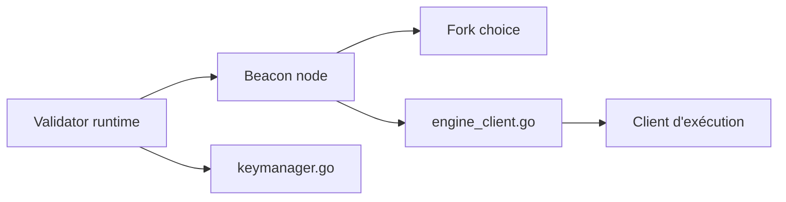

# OffchainLabs/prysm

> Implémentation Go du consensus Ethereum (nœud beacon et validateur), développée par Offchain Labs.

## Le problème
Participer à Ethereum en preuve d'enjeu exige un client de couche consensus.

## Ce que ça fait vraiment
Nœud beacon (synchronisation, choix de fork, transitions d'état, API) et runtime validateur (gestion des clés, signataire distant). Slasher, light client et base de données dans l'arbre. Installation et usage renvoient à un portail de documentation ; le README les détaille peu.

## Comment c'est branché

## Essayer
Aucune commande documentée dans le README (renvoi à la documentation officielle).

## Coût et pièges
Gratuit, mais le staking engage des fonds réels (lancement via le launchpad Ethereum). Un client d'exécution est nécessaire.

## Ce que ce n'est pas
Pas un client d'exécution. Le README mentionne des fichiers d'instructions pour agents de code (`.agents/AGENTS.md`).

## Alternatives
Aucune citée dans le README.

## Pour toi
Opérer un validateur Ethereum n'a pas de lien avec un profil data/IA : ignorer.

