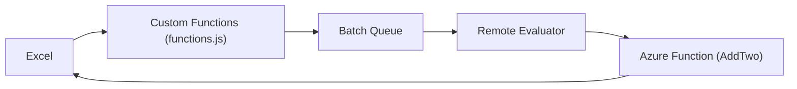

# OfficeDev/Office-Add-in-samples

> Collection d'exemples de compléments Office (Excel, Outlook, Word, PowerPoint) pour apprendre à en construire.

## Le problème
Écrire un complément Office demande de comprendre manifeste, task pane, authentification et API Office.js.

## Ce que ça fait vraiment
Catalogue d'exemples : « hello world » par application, tutoriels terminés, Blazor WebAssembly, authentification et SSO (MSAL, NAA, Microsoft Graph), activation par événements Outlook, fonctions personnalisées Excel (batching, web worker, Azure Function), runtime partagé, migration VSTO. Le schéma généré ne couvre qu'une partie des dossiers.

## Comment c'est branché

## Essayer
Aucune commande dans ce README : chaque exemple a sa propre documentation, avec les guides et tutoriels de Microsoft.

## Coût et pièges
Gratuit ; un compte Microsoft 365 (programme développeur possible) est nécessaire pour tester. Certaines fonctions sont en préversion publique.

## Ce que ce n'est pas
Pas une bibliothèque installable : des exemples à lire et copier.

## Alternatives
Le README ne cite aucune alternative.

## Pour toi
À ignorer, sauf si tu construis des compléments Excel pour diffuser des résultats : sinon aucun lien avec un flux data/IA/MLOps.
