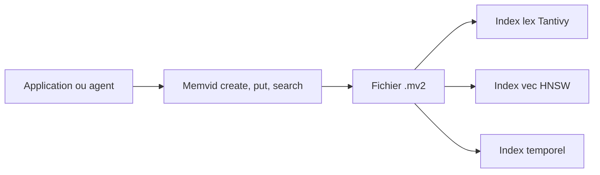

# Olow304/memvid

> Couche de mémoire pour agents IA dans un seul fichier portable, sans base de données à faire tourner.

## Le problème
Donner une mémoire longue à un agent oblige à exploiter une base vectorielle ou un pipeline RAG.

## Ce que ça fait vraiment
Un fichier `.mv2` contient en-tête, journal d'écriture, segments compressés (« Smart Frames » en ajout seul), index plein texte (Tantivy), index vectoriel (HNSW) et index temporel. Recherche, chronologie et retour à un état passé. Fonctions optionnelles : PDF, CLIP, Whisper, embeddings ONNX locaux ou OpenAI, chiffrement. SDK Rust, Node, Python et CLI.

## Comment c'est branché


## Essayer
```bash
pip install memvid-sdk
cargo add memvid-core
cargo run --example basic_usage
```

## Coût et pièges
Gratuit ; Rust 1.85+ pour compiler. Les modèles d'embedding locaux se téléchargent à la main (BGE-small, environ 120 Mo). OpenAI demande une clé.

## Ce que ce n'est pas
Les chiffres de benchmark du README (précision, latence) viennent de l'auteur et sont à reproduire. Le schéma d'architecture fourni décrit une ancienne version Python (MP4 et JSON) qui diffère du README (Rust, `.mv2`) : le README est retenu ici.

## Alternatives
Aucune alternative nommée dans le README.

## Pour toi
À surveiller : idée intéressante de mémoire sans serveur, mais deux versions divergentes et des chiffres non vérifiés.
