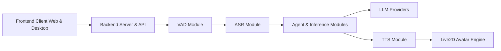

# Open-LLM-VTuber/Open-LLM-VTuber

> Compagnon IA vocal avec avatar Live2D, exécutable hors ligne, en web ou bureau.

## Le problème
Assembler reconnaissance vocale, LLM, synthèse vocale et avatar animé en temps réel demande beaucoup d'intégration.

## Ce que ça fait vraiment
Boucle voix : VAD → ASR (sherpa-onnx, Faster-Whisper…) → agent/LLM (Ollama, OpenAI, Claude…) → TTS (MeloTTS, CosyVoice, Edge TTS…).
Avatar Live2D avec expressions, mode « pet » transparent sur le bureau, perception caméra/écran.
Modules interchangeables par configuration via des factories ; historique de chat persistant.

## Comment c'est branché


## Essayer
```bash
uv run update.py
```

## Coût et pièges
Gratuit en local (GPU conseillé) ; accès distant exige HTTPS pour le micro. v1.0.0 a cassé la config.

## Ce que ce n'est pas
En pause fonctionnelle : l'équipe réécrit tout en v2 et refuse les nouvelles demandes sur v1. Modèles Live2D sous licence séparée.

## Alternatives
- ylxmf2005/LLM-Live2D-Desktop-Assitant : assistant bureau Live2D avec contrôle de l'ordinateur, cité comme projet lié.

## Pour toi
À ignorer : application grand public en refonte ; seul le câblage ASR→LLM→TTS modulaire peut servir d'exemple.
