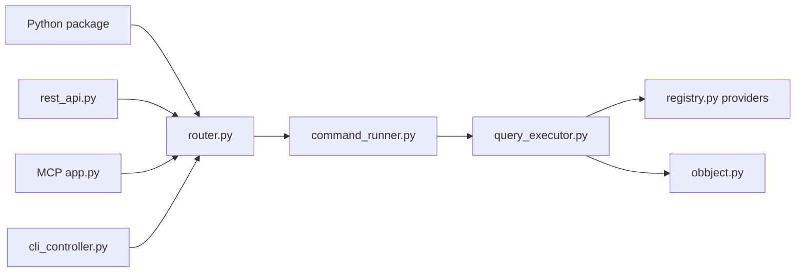

# OpenBB-finance/OpenBB

> Couche Python qui unifie des sources de données financières et les expose en Python, REST, CLI et MCP.

## Le problème
Chaque fournisseur de données financières a son API, son format et son authentification : il faut les réintégrer pour chaque outil qui les consomme.

## Ce que ça fait vraiment
`obb.equity.price.historical("AAPL")` renvoie un résultat normalisé convertible en DataFrame. Une commande passe par un routeur (`router.py`), un exécuteur (`command_runner.py`) et une requête fournisseur (`query_executor.py`) choisie dans un registre (`registry.py`), puis revient en objet résultat (`obbject.py`).
Les mêmes données sont servies par une API FastAPI (`openbb-api`, port 6900), un CLI (`openbb-cli`) et un serveur MCP pour agents. Le backend se branche aussi sur OpenBB Workspace, l'interface commerciale.

## Comment c'est branché


## Essayer
```bash
pip install openbb
pip install "openbb[all]"
openbb-api
pip install openbb-cli
```

## Coût et pièges
Bibliothèque gratuite, Python 3.9.21 à 3.12. Certains fournisseurs sont « propriétaires ou sous licence » : leurs accès restent à ta charge. OpenBB Workspace demande un compte.

## Ce que ce n'est pas
Pas une source de données : un connecteur. Le README précise que les données ne sont pas forcément exactes et qu'OpenBB décline toute responsabilité. L'interface d'analyse n'est pas ici : c'est Workspace.

## Alternatives
Aucune alternative nommée dans le README.

## Pour toi
À surveiller si tu touches à la finance ; son serveur MCP de données est un bon modèle à copier.
