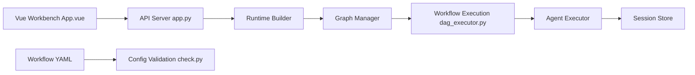

# OpenBMB/ChatDev

> Plateforme sans code d'orchestration multi-agents LLM, configurée en YAML, pour prototyper des workflows.

## Le problème
Monter un système multi-agents demande d'écrire l'orchestration, les boucles et la gestion d'état à la main.

## Ce que ça fait vraiment
ChatDev 2.0 (DevAll) : backend FastAPI (`server/`) + console Vue 3 avec canevas visuel pour définir agents, nœuds et flux.
Le runtime valide la config, construit le graphe (cycles inclus), exécute en DAG, appelle modèles, skills et outils, archive sessions et artefacts.
Workflows fournis dans `yaml_instance/` : visualisation de données, 3D Blender, deep research, jeu vidéo, vidéo pédagogique.
SDK Python (`chatdev` sur PyPI) ; ChatDev 1.0 (« entreprise virtuelle ») conservé en legacy.

## Comment c'est branché


## Essayer
```bash
uv sync
cd frontend && npm install
cp .env.example .env
make dev
docker compose up --build
```

## Coût et pièges
`API_KEY` et `BASE_URL` d'un fournisseur LLM requis : chaque workflow multi-agents consomme beaucoup de jetons. Python 3.12+, Node 18+, uv.

## Ce que ce n'est pas
Pas un générateur de logiciel fiable « clé en main » ; les workflows 3D exigent Blender et blender-mcp. Gouvernance non précisée (laboratoire académique OpenBMB supposé).

## Alternatives
Aucune alternative nommée dans le README (OpenClaw est cité comme client, pas comme concurrent).

## Pour toi
Bon terrain d'expérimentation pour des pipelines d'agents déclaratifs ; surveille la facture de jetons.
