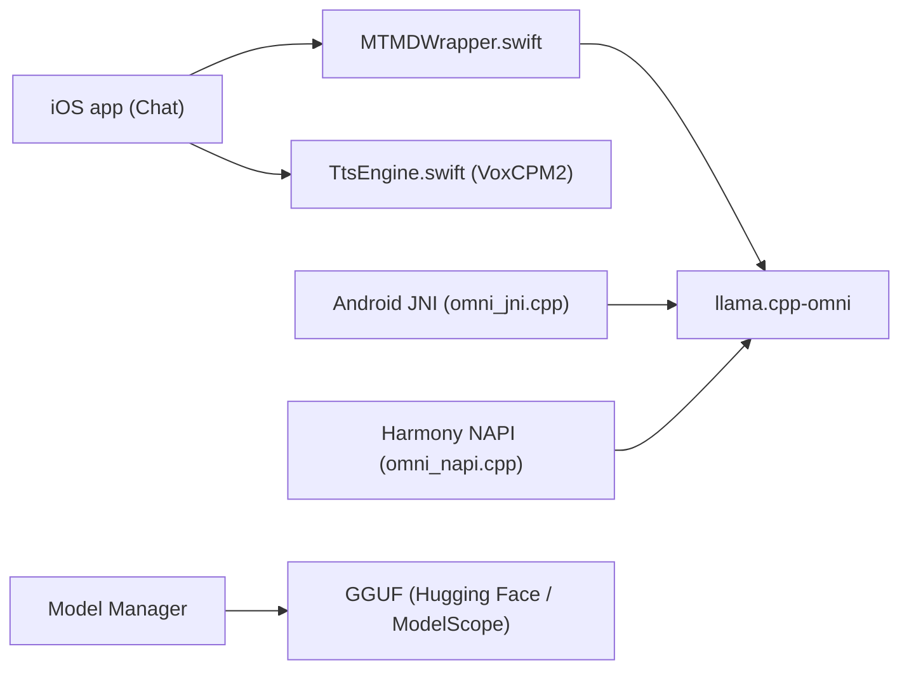

# OpenBMB/MiniCPM-V-Apps

> Démos iOS, Android et HarmonyOS qui font tourner les modèles MiniCPM-V entièrement sur l'appareil via llama.cpp.

## Le problème
Exécuter un modèle multimodal en local sur téléphone, sans serveur ni envoi de données, demande un portage llama.cpp et des applications natives.

## Ce que ça fait vraiment
Trois applications (Xcode, Gradle/Kotlin, DevEco/ArkTS) partagent le sous-module `llama.cpp-omni`. Elles gèrent le chat texte, image et vidéo, la capture caméra en temps réel, un écran de synthèse vocale (VoxCPM2) et un gestionnaire de modèles qui télécharge les GGUF. Modèles pris en charge : MiniCPM-V 2.6, 4.0 et 4.6, MiniCPM5 1B et 2B (texte seul), VoxCPM2. Ponts natifs : `MTMDWrapper.swift`, `omni_jni.cpp`, `omni_napi.cpp`.

## Comment c'est branché


## Essayer
```bash
git clone --recurse-submodules --shallow-submodules https://github.com/OpenBMB/MiniCPM-V-Apps.git
./scripts/build_xcframework.sh
cd MiniCPM-V-demo-Android
./gradlew assembleDebug
```

## Coût et pièges
Compte Apple ou Huawei pour déployer sur appareil. RAM recommandée de 4 à 8 Go selon le modèle (V 2.6 : 8 Go ou plus). Contexte par défaut de 4K tokens. Le sous-module pèse environ 350 Mo en clone complet. Aucune licence déclarée sur le dépôt.

## Ce que ce n'est pas
Pas une application publiée : ce sont des démos à compiler, même si un DOWNLOAD.md renvoie à des paquets précompilés. Les poids ont leurs propres licences, non détaillées ici.

## Alternatives
Aucune alternative nommée dans le README.

## Pour toi
À surveiller : bon point de départ pour de l'inférence multimodale embarquée sur mobile, mais l'absence de licence bloque toute réutilisation à ce stade.

