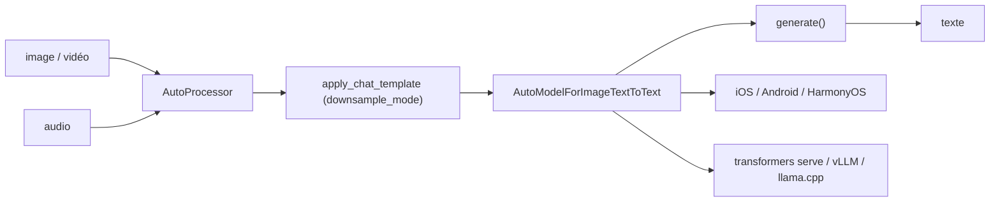

# OpenBMB/MiniCPM-V

> Série de modèles multimodaux compacts pour image, vidéo et voix, déployables sur téléphone.

## Le problème
Les modèles vision-langage utilisables demandent un GPU serveur : rien ne tourne sur l'appareil.
L'encodage visuel coûte plus cher que le texte et fait exploser le nombre de tokens.

## Ce que ça fait vraiment
MiniCPM-V 4.6 : 1,3 milliard de paramètres, bâti sur SigLIP2-400M et Qwen3.5-0.8B, compression visuelle mixte 4x/16x.
La compression précoce intra-ViT (LLaVA-UHD v4) réduit de plus de moitié le coût de calcul de l'encodage visuel.
MiniCPM-o 4.5 : 9 milliards de paramètres, bout en bout, flux vidéo et audio entrants avec sortie texte et voix simultanées, sans blocage mutuel.
Clonage de voix depuis un extrait de référence, parsing de documents, plus de 30 langues ; variantes quantifiées GGUF, BNB, AWQ, GPTQ.

## Comment c'est branché


## Essayer
```bash
pip install "transformers[torch]>=5.7.0" torchvision torchcodec
pip install "transformers[serving]>=5.7.0"
transformers serve openbmb/MiniCPM-V-4.6 --port 8000 --host 0.0.0.0 --continuous-batching
pip install "transformers==4.51.0" accelerate "torch>=2.3.0,<=2.8.0" "torchaudio<=2.8.0" "minicpmo-utils[all]>=1.0.5"
```

## Coût et pièges
`torchcodec` casse selon la version de CUDA : replier sur PyAV ou épingler l'index PyTorch correspondant.
MiniCPM-o 4.5 exige `transformers==4.51.0` exactement, incompatible avec la pile 5.7+ de MiniCPM-V 4.6 : deux environnements distincts.
FFmpeg est requis pour l'extraction de trames vidéo et la génération de vidéo duplex.

## Ce que ce n'est pas
Ce n'est pas un seul modèle : deux familles aux dépendances incompatibles cohabitent dans le même dépôt.
Ce ne sont pas des comparaisons neutres : une partie des scores des concurrents provient de l'évaluation des auteurs (marqués d'un astérisque).
Le README ne déclare pas la licence des poids ; il est tronqué au milieu des instructions d'installation de FFmpeg.

## Alternatives
Qwen3-VL-8B, Qwen3-Omni-30B : comparés tout au long du README, plus gros et plus coûteux à servir.
DeepSeek-OCR 2, dots.ocr, HunyuanOCR : cités sur le parsing documentaire, à préférer si c'est le seul besoin.

## Pour toi
À tester pour de l'OCR ou de la compréhension vidéo locale à faible coût GPU — vérifie la licence des poids avant tout usage client.
