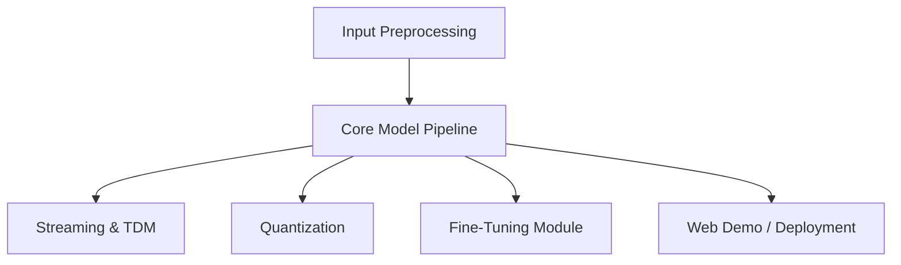

# OpenBMB/MiniCPM-o

> Modèles multimodaux compacts : MiniCPM-V 4.6 (1,3 Md) pour l'image et la vidéo, MiniCPM-o 4.5 (9 Md) pour la voix en direct.

## Le problème
Faire tourner de la vision, de la voix et de la vidéo sur un appareil personnel sans gros serveur.

## Ce que ça fait vraiment
V 4.6 comprend images et vidéos, avec compression de jetons visuels 4x/16x et code d'adaptation iOS, Android, HarmonyOS. o 4.5 traite vidéo et audio en flux continu et produit texte et parole en même temps (duplex intégral), avec clonage de voix. Inférence via transformers, vLLM, SGLang, llama.cpp, Ollama ; fine-tuning avec LLaMA-Factory ou SWIFT ; variantes quantifiées.

## Comment c'est branché


## Essayer
```bash
pip install "transformers[torch]>=5.7.0" torchvision torchcodec
transformers serve openbmb/MiniCPM-V-4.6 --port 8000 --host 0.0.0.0 --continuous-batching
```

## Coût et pièges
V 4.6 : 4 Go de GPU annoncés ; o 4.5 : 19 Go (28 Go pour la démo web en PyTorch). Versions de transformers strictement épinglées (5.7 ou 4.51 selon le modèle). Les scores viennent du README.

## Ce que ce n'est pas
Le mode duplex reste instable (limites listées : voix erronée, mélange de langues). Le README refuse toute responsabilité sur le contenu généré.

## Alternatives
- Qwen3-Omni-30B-A3B : comparé dans les tableaux du README.
- PaddleOCR-VL et MinerU 2.5 : comparés pour le parsing de documents.

## Pour toi
À surveiller : bon candidat de VLM local léger, à évaluer sur tes données ; la licence n'est pas déclarée dans le catalogue.
