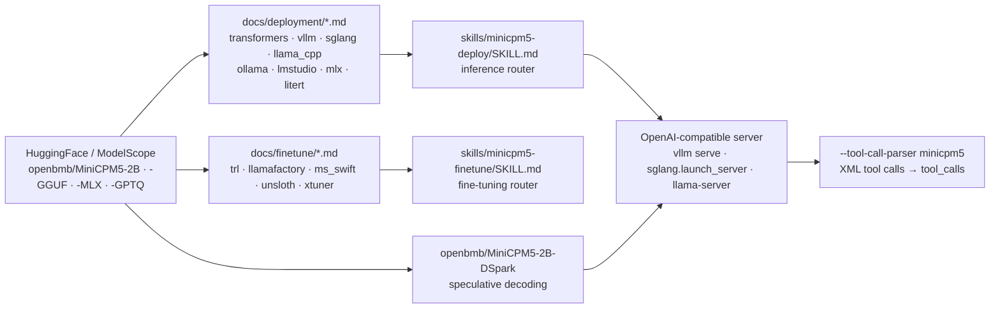

# OpenBMB/MiniCPM

> **OpenBMB's family of small language models, for anyone who wants an assistant running locally.**

## The problem

Running an assistant, a tool-use agent or a coding agent without calling a remote API means
finding a model that fits the memory you actually have — a laptop, an Apple Silicon Mac, a
consumer card, sometimes a phone. Models of that size are plentiful, but bringing each one into
service is a separate job: locate the weight format, wire up an inference engine, reproduce the
chat template, get tool calls out in the shape your client expects.

## What it actually does

This repository hosts neither training nor inference code: it is the documentation entry point
for a model family whose weights live on HuggingFace and ModelScope. The current release is
**MiniCPM5-2B** (2,516,756,480 parameters, 42 layers, GQA attention with 16 Q / 2 KV heads,
native 131,072-token context), published on 2026-09-07 after MiniCPM5-1B. The README states a
standard `LlamaForCausalLM` architecture — "no custom kernels, no model-code fork" — so existing
engines load the weights as they are.

Each model ships as separately published variants: Base, SFT, Midtrain, GGUF, MLX, GPTQ, plus a
DSpark draft model for speculative decoding. For every backend the repository provides a
single-page cookbook under `docs/deployment/` (Transformers, vLLM, SGLang, llama.cpp, Ollama,
LM Studio, MLX, ArcLight, LiteRT-LM, vLLM Ascend) and, for tuning, `docs/finetune/` (TRL + PEFT,
LLaMA-Factory, ms-swift, unsloth, xtuner). Each cookbook is paired with an *Agent Skill* under
`skills/`, aimed at Cursor or Claude Code, behind two top-level routers: `minicpm5-deploy` and
`minicpm5-finetune`.

The README also documents the training recipe (base, mid-training, then SFT → RL → OPD, the
on-policy distillation that merges 16 expert models produced by RL) and announces the matching
corpora under the UltraData banner: Ultra-FineWeb, UltraX, UltraData-Code, UltraData-Math,
UltraData-SFT-2605, UltraData-SFT-Agent-2609, UltraData-RL-2609. Other lineages share the same
README: MiniCPM-SALA (hybrid sparse + linear attention, million-token context) and the MiniCPM4
/ 4.1 series.

## How it is wired



No code-derived diagram exists for this repository: this one is reconstructed from the README
alone. The point to keep is that the repository itself contains only `docs/` and `skills/`: the
weights are elsewhere, execution is delegated to a third-party engine, and the repository's job
is to route you to the right cookbook given backend, hardware and weight format.

## Trying it

```bash
pip install "vllm>=0.21"
vllm serve openbmb/MiniCPM5-2B --port 8000
```

```bash
curl http://localhost:8000/v1/chat/completions \
  -H "Content-Type: application/json" \
  -d '{
    "model": "openbmb/MiniCPM5-2B",
    "messages": [{"role": "user", "content": "Who are you? Please briefly introduce yourself."}],
    "max_tokens": 128,
    "temperature": 1.0, "top_p": 0.95
  }'
```

For tool calling the README recommends SGLang, the only backend whose built-in parser converts
the model's XML calls natively:

```bash
pip install "sglang[srt]>=0.5.16"
python -m sglang.launch_server --model-path openbmb/MiniCPM5-2B --port 30000 \
    --tool-call-parser minicpm5      # or: --tool-call-parser auto
```

Without a GPU, the GGUF route:

```bash
llama-server -m MiniCPM5-2B-F16.gguf -a MiniCPM5-2B --port 8080 -ngl 99 -c 8192 --jinja
```

## Cost and traps

- **The weights are not in the repository**: everything goes through HuggingFace or ModelScope.
  Accounts, bandwidth and the availability of those platforms are part of the chain — that is
  the reason for the alert kept on this card.
- **Demanding version floors**: `vllm>=0.21`, `sglang[srt]>=0.5.16`, `transformers>=5.6`. A
  frozen, older environment will not load the model.
- **Sampling parameters are prescribed**: the README recommends `temperature=1.0, top_p=0.95,
  min_p=0.0`, and notes that llama.cpp's default `min_p=0.05` causes repetitive output. For
  looping output it suggests `repetition_penalty=1.05`. This is not a detail: it is the first
  reason a trial run disappoints.
- **The 131,072-token context is native but costs memory**; the llama.cpp command in the README
  sets `-c 8192` and invites you to adjust.
- **Support depends on the backend**: the README states that sampling-parameter support varies
  by inference framework, and reserves reliable tool calling for SGLang.
- **The published figures are in-house**: "2B-class open-source SOTA" and the 53.9 average are
  given *within this comparison set*, a set chosen by the team. Re-run them on your own task.
- **MiniCPM-SALA is paid for in compilation**: install from a `minicpm_sala` branch of an SGLang
  fork, compile `infllmv2_cuda_impl` and `sparse_kernel`, CUDA 12+, `gcc`/`g++`, Python 3.12.
  Nothing like the `pip install` path of the MiniCPM5 models.

## What it is not

- **Not an inference engine, not a library you import.** You do not install MiniCPM: you install
  vLLM, SGLang, llama.cpp or Transformers and hand them a model id. The repository is
  documentation and a set of cookbooks, not executable code.
- **Not a multimodal model.** The vision lineage is a separate repository, MiniCPM-V, linked from
  the header. This README covers text only.
- **Not an application**: no interface, no ready-to-run service, no installable assistant. The
  only finished product mentioned is the desktop pet, itself in a separate repository.
- **A repository with several lineages**: MiniCPM5, MiniCPM-SALA, MiniCPM4 and MiniCPM4.1 share
  one README with unrelated installation requirements. Read your model's section, not the whole
  README.

## Alternatives

| | When to prefer it |
|---|---|
| **OpenBMB/MiniCPM-V** | Linked from the README header: same family, but for vision. Prefer it as soon as the input is not text alone. |
| **Qwen3.5-2B · Gemma-4-E2B-it · LFM2.5-2.6B** | The same-class models the README explicitly picks as its comparison set. Evaluate them side by side rather than on trust: the reported gaps are measured by the team publishing them. |
| **OpenBMB/MiniCPM-Desk-Pet** | Named in the README: the desktop pet that embeds MiniCPM5-1B behind a `llama-server` sidecar. Prefer it if you want a finished local application rather than a model to integrate. Note that its UI layer derives from an AGPL-3.0 project. |

The catalogue's suggested neighbours (`opendatalab/MinerU`, `andrewyng/aisuite`, `h2oai/h2ogpt`,
`cvg/LightGlue`) are not comparable: document extraction, a multi-provider abstraction layer, a
RAG platform and image keypoint matching are not language models you would deploy in its place.

## For you

Worth adopting as a local building block whenever a task must stay on the machine: offline
assistant, tool-calling agent, high-volume preprocessing where API calls would add up. The 2B
class runs on a laptop or a consumer card, and the Apache-2.0 licence settles the internal-use
question. The side benefit lies elsewhere: the training recipe is described and the UltraData
corpora are published, making this one of the few documented footholds for understanding — or
replaying — an SFT → RL → on-policy-distillation chain. Skip it if the task needs frontier-model
quality: that is a different order of magnitude, and the README does not claim otherwise.
