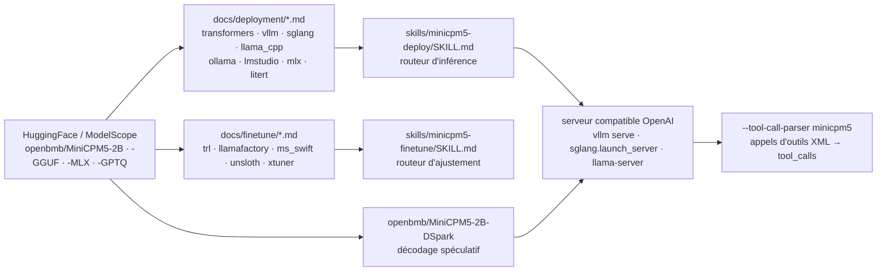

# OpenBMB/MiniCPM

> **La famille de petits modèles de langage d'OpenBMB, pour qui veut faire tourner un assistant en local.**

## Le problème

Faire tourner un assistant, un agent d'outillage ou un agent de code sans appeler une API
distante suppose un modèle qui tienne dans la mémoire disponible — portable, Mac Apple
Silicon, carte grand public, voire téléphone. Les modèles de cette taille sont nombreux mais
leur mise en service est chaque fois un travail à part : format de poids à trouver, moteur
d'inférence à câbler, gabarit de conversation à reproduire, appel d'outils à faire sortir au
format attendu par le client.

## Ce que ça fait vraiment

Ce dépôt n'héberge pas de code d'entraînement ni d'inférence : c'est le point d'entrée
documentaire d'une famille de modèles, dont les poids vivent sur HuggingFace et ModelScope.
La version courante est **MiniCPM5-2B** (2 516 756 480 paramètres, 42 couches, attention GQA
16 Q / 2 KV, contexte natif de 131 072 jetons), publiée le 07/09/2026 à la suite de
MiniCPM5-1B. Le README revendique une architecture `LlamaForCausalLM` standard — donc, écrit-il,
« no custom kernels, no model-code fork » : les moteurs existants chargent les poids tels quels.

Chaque modèle est décliné en variantes publiées séparément : Base, SFT, Midtrain, GGUF, MLX,
GPTQ, et un modèle brouillon DSpark pour le décodage spéculatif. Le dépôt fournit, pour chaque
backend, une fiche de recette d'une page dans `docs/deployment/` (Transformers, vLLM, SGLang,
llama.cpp, Ollama, LM Studio, MLX, ArcLight, LiteRT-LM, vLLM Ascend) et, pour l'ajustement,
`docs/finetune/` (TRL + PEFT, LLaMA-Factory, ms-swift, unsloth, xtuner). Chaque recette est
doublée d'un *Agent Skill* dans `skills/`, destiné à Cursor ou Claude Code, avec deux skills
routeurs de tête : `minicpm5-deploy` et `minicpm5-finetune`.

Le README documente aussi la recette d'entraînement (base, mid-training, puis SFT → RL → OPD,
la distillation sur politique qui fusionne 16 modèles experts issus du RL) et annonce la
publication des corpus correspondants sous la marque UltraData : Ultra-FineWeb, UltraX,
UltraData-Code, UltraData-Math, UltraData-SFT-2605, UltraData-SFT-Agent-2609, UltraData-RL-2609.
D'autres lignées cohabitent dans le même README : MiniCPM-SALA (attention hybride creuse +
linéaire, contexte au million de jetons) et les séries MiniCPM4 / 4.1.

## Comment c'est branché



Aucun diagramme tiré du code n'existe pour ce dépôt : ce schéma est reconstruit depuis le seul
README. Le point à retenir est que le dépôt lui-même ne contient que des `docs/` et des
`skills/` : les poids sont ailleurs, l'exécution est déléguée à un moteur tiers, et le rôle du
dépôt est d'aiguiller vers la bonne recette selon le backend, le matériel et le format de poids.

## Essayer

```bash
pip install "vllm>=0.21"
vllm serve openbmb/MiniCPM5-2B --port 8000
```

```bash
curl http://localhost:8000/v1/chat/completions \
  -H "Content-Type: application/json" \
  -d '{
    "model": "openbmb/MiniCPM5-2B",
    "messages": [{"role": "user", "content": "Who are you? Please briefly introduce yourself."}],
    "max_tokens": 128,
    "temperature": 1.0, "top_p": 0.95
  }'
```

Pour les appels d'outils, le README recommande SGLang, seul backend dont l'analyseur intégré
convertit nativement les appels XML du modèle :

```bash
pip install "sglang[srt]>=0.5.16"
python -m sglang.launch_server --model-path openbmb/MiniCPM5-2B --port 30000 \
    --tool-call-parser minicpm5      # or: --tool-call-parser auto
```

Sans GPU, la voie GGUF :

```bash
llama-server -m MiniCPM5-2B-F16.gguf -a MiniCPM5-2B --port 8080 -ngl 99 -c 8192 --jinja
```

## Coût et pièges

- **Les poids ne sont pas dans le dépôt** : tout passe par HuggingFace ou ModelScope. Compte,
  bande passante et disponibilité de ces plateformes sont dans la chaîne — c'est la raison de
  l'alerte conservée.
- **Versions planchers exigeantes** : `vllm>=0.21`, `sglang[srt]>=0.5.16`, `transformers>=5.6`.
  Un environnement figé plus ancien ne chargera pas le modèle.
- **Paramètres d'échantillonnage imposés** : le README recommande `temperature=1.0, top_p=0.95,
  min_p=0.0`, et précise que la valeur par défaut `min_p=0.05` de llama.cpp provoque des
  répétitions. En cas de sortie qui boucle, il propose `repetition_penalty=1.05`. Ce n'est pas
  un détail : c'est le premier motif de déception à l'essai.
- **Le contexte de 131 072 jetons est natif mais coûte de la mémoire** ; la commande llama.cpp
  donnée dans le README fixe `-c 8192` et invite à ajuster.
- **Le support dépend du backend** : le README écrit que la prise en charge des paramètres
  d'échantillonnage varie selon le moteur d'inférence, et réserve l'appel d'outils fiable à SGLang.
- **Les chiffres annoncés sont internes** : le « 2B-class open-source SOTA » et la moyenne de
  53,9 sont donnés *within this comparison set*, un jeu de comparaison choisi par l'équipe. À
  rejouer soi-même sur sa tâche.
- **MiniCPM-SALA se paie en compilation** : installation depuis une branche `minicpm_sala` d'un
  fork de SGLang, compilation de `infllmv2_cuda_impl` et `sparse_kernel`, CUDA 12+, `gcc`/`g++`,
  Python 3.12. Rien à voir avec le `pip install` des modèles MiniCPM5.

## Ce que ce n'est pas

- **Ce n'est pas un moteur d'inférence ni une bibliothèque à importer.** On n'installe pas
  MiniCPM : on installe vLLM, SGLang, llama.cpp ou Transformers, et on leur donne un identifiant
  de modèle. Le dépôt est une documentation et un jeu de recettes, pas du code exécutable.
- **Ce n'est pas un modèle multimodal.** La lignée vision est un dépôt séparé, MiniCPM-V, lié
  depuis l'en-tête. Le README de celui-ci ne traite que du texte.
- **Ce n'est pas une application** : ni interface, ni serveur prêt à l'emploi, ni assistant
  installable. Le seul produit fini mentionné est le compagnon de bureau, lui aussi dans un
  dépôt distinct.
- **Un dépôt à lignées multiples** : MiniCPM5, MiniCPM-SALA, MiniCPM4 et MiniCPM4.1 coexistent
  dans le même README, avec des exigences d'installation sans rapport entre elles. Lire la
  section de son modèle, pas le README en entier.

## Alternatives

| | Quand le préférer |
|---|---|
| **OpenBMB/MiniCPM-V** | Lié dès l'en-tête du README : même famille, mais pour la vision. À préférer dès que l'entrée n'est pas uniquement du texte. |
| **Qwen3.5-2B · Gemma-4-E2B-it · LFM2.5-2.6B** | Les modèles de même classe explicitement retenus par le README comme jeu de comparaison. À évaluer en parallèle plutôt que sur parole : les écarts annoncés sont mesurés par l'équipe qui publie. |
| **OpenBMB/MiniCPM-Desk-Pet** | Cité dans le README : le compagnon de bureau qui embarque MiniCPM5-1B via un `llama-server`. À préférer si l'objectif est une application locale finie plutôt qu'un modèle à intégrer. Attention, sa couche d'interface est dérivée d'un projet sous AGPL-3.0. |

Les voisins proposés par le catalogue (`opendatalab/MinerU`, `andrewyng/aisuite`,
`h2oai/h2ogpt`, `cvg/LightGlue`) ne sont pas comparables : extraction de documents, couche
d'abstraction multi-fournisseurs, plateforme RAG et appariement de points d'image ne sont pas
des modèles de langage qu'on déploierait à la place de celui-ci.

## Pour toi

À adopter comme brique locale quand une tâche doit rester sur la machine : assistant hors
ligne, agent d'appel d'outils, prétraitement à fort volume où l'appel d'API se chiffrerait.
La classe 2B se fait sur portable ou carte grand public, et la licence Apache-2.0 lève la
question de l'usage interne. L'intérêt annexe est ailleurs : la recette d'entraînement est
décrite et les corpus UltraData sont publiés, ce qui en fait un des rares points d'appui
documentés pour qui veut comprendre — ou rejouer — une chaîne SFT → RL → distillation sur
politique. À ne pas choisir si la tâche demande le niveau d'un modèle de frontière : ce n'est
pas le même ordre de grandeur, et le README ne le prétend pas.
