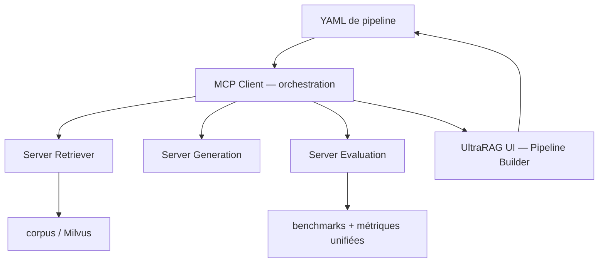

# OpenBMB/UltraRAG

> Framework RAG orchestré en YAML, dont chaque composant est un serveur MCP.

## Le problème
Un RAG itératif — boucles, branches conditionnelles, réécriture de requête — se code d'ordinaire en centaines de lignes de glue.
Comparer deux variantes sur un benchmark demande encore plus de tuyauterie.

## Ce que ça fait vraiment
Les composants (Retriever, Generation, etc.) sont des serveurs MCP indépendants ; un client MCP orchestre séquences, boucles et branches décrites en YAML.
Ajouter une fonctionnalité revient à l'enregistrer comme Tool : elle entre dans les workflows sans toucher au reste.
Des workflows d'évaluation standardisés et des benchmarks de recherche prêts à l'emploi permettent de comparer des baselines avec une gestion unifiée des métriques.
L'UI est un IDE visuel : Pipeline Builder avec synchronisation bidirectionnelle canvas ↔ code, assistant IA pour la structure et les prompts, conversion en un clic d'un pipeline en Web UI conversationnelle.

## Comment c'est branché


## Essayer
```bash
git clone https://github.com/OpenBMB/UltraRAG.git --depth 1
cd UltraRAG
uv sync --all-extras
source .venv/bin/activate
ultrarag run examples/experiments/sayhello.yaml
# ou en Docker :
docker run -it --gpus all -p 5050:5050 hdxin2002/ultrarag:v0.3.0
```

## Coût et pièges
Gratuit, mais l'installation complète verrouille les dépendances GPU Linux sur CUDA 12.9, roue vLLM cu129 comprise : il faut la bonne machine.
Le déploiement de production suppose de monter soi-même un Retriever, un LLM et une base vectorielle Milvus.

## Ce que ce n'est pas
Ce n'est pas un produit fini : le positionnement affiché est « exploration de recherche et prototypage industriel », porté par THUNLP, NEUIR, OpenBMB et AI9stars.
Ce n'est pas non plus léger malgré le slogan : l'installation « core » ne fait tourner que l'UI, le reste arrive par extras.

## Alternatives
- AgentCPM-Report : le modèle 8B compagnon, si ton besoin est le rapport long plutôt que le framework.
- MiniCPM-Embedding-Light : l'embedding maison cité dans les publications.

## Pour toi
Le bon terrain pour comparer proprement des variantes de RAG ; l'IDE visuel et le MCP en font une pièce lourde pour de la prod.
