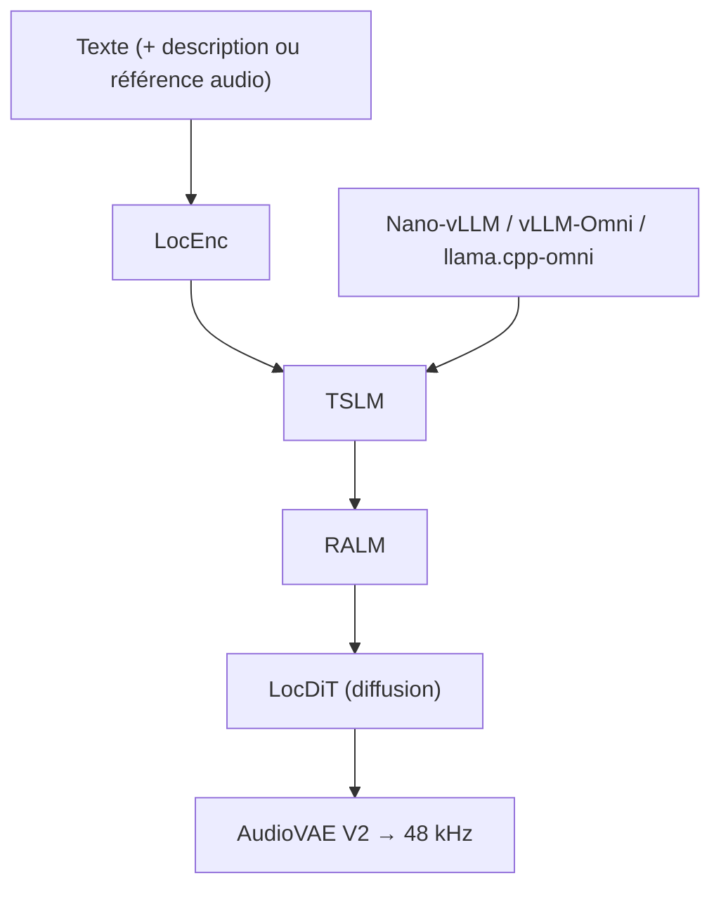

# OpenBMB/VoxCPM

> Modèle de synthèse vocale sans tokenizer, 30 langues, clonage et conception de voix.

## Le problème
Les systèmes TTS passant par une tokenisation discrète perdent des nuances de timbre et de prosodie,
et la plupart des modèles ouverts restent bilingues et bridés en qualité audio.

## Ce que ça fait vraiment
Génère directement des représentations continues de parole par une architecture autorégressive
à diffusion, sans tokenisation discrète. VoxCPM2 fait 2 milliards de paramètres, entraîné sur plus
de 2 millions d'heures, sur un socle MiniCPM-4.
Accepte du texte dans 30 langues sans balise de langue, plus neuf dialectes chinois.
Crée une voix à partir d'une description en langage naturel (Voice Design), clone une voix depuis
un court extrait avec pilotage optionnel de l'émotion et du rythme, ou reproduit chaque nuance en
fournissant extrait et transcription (Ultimate Cloning).
Sort du 48 kHz à partir d'une référence 16 kHz via AudioVAE V2, avec super-résolution intégrée.
RTF d'environ 0,3 sur RTX 4090, ~0,13 avec Nano-vLLM ou vLLM-Omni.

## Comment c'est branché


## Essayer
```bash
pip install voxcpm
voxcpm design --text "VoxCPM2 brings studio-quality multilingual speech synthesis." --output out.wav
voxcpm clone --text "This is a voice cloning demo." --reference-audio path/to/voice.wav --output out.wav
python app.py --port 8808
vllm serve openbmb/VoxCPM2 --omni --port 8000
```

## Coût et pièges
Poids et code sous Apache 2.0, usage commercial libre. Il faut un GPU : ~8 Go de VRAM pour VoxCPM2,
Python ≥ 3.10 (< 3.13), PyTorch ≥ 2.5.0, CUDA ≥ 12.0. Le service haute charge passe par
Nano-vLLM ou vLLM-Omni, à installer et exploiter. Sur Apple Silicon, `--device auto` bascule sur MPS.

## Ce que ce n'est pas
Ce n'est pas uniformément bon sur les 30 langues : les tableaux du README montrent des WER très
dégradés en arabe, tchèque, hindi et roumain, alors que la similarité de voix est souvent en tête.
Ce n'est pas un produit avec garde-fous : le clonage de voix depuis un court extrait pose des
questions de consentement que le README ne traite pas dans la partie lue.

## Alternatives
Le README ne cite d'autres modèles que dans ses tableaux de comparaison : F5-TTS, CosyVoice2/3,
MaskGCT, IndexTTS2, Qwen3-TTS, FishAudio S2 — tous mesurés, aucun recommandé.

## Pour toi
À garder sous le coude pour de la voix off multilingue locale, si tu as la carte qui va avec.
