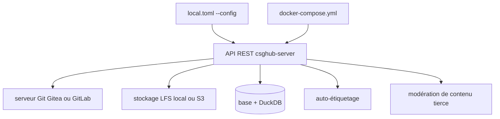

# OpenCSGs/csghub-server

> Backend REST d'une plateforme auto-hébergée de gestion de modèles et de jeux de données.

## Le problème
Héberger ses propres modèles et jeux de données suppose un dépôt Git, un stockage LFS et un catalogue — trois systèmes à relier soi-même.
Sans interface de recherche et de prévisualisation, personne dans l'équipe ne retrouve ce qui existe déjà.

## Ce que ça fait vraiment
Gère utilisateurs et organisations, avec recherche sur les personnes, organisations, modèles et données.
Étiquette automatiquement modèles et jeux de données, et suit leur activité : téléchargements, likes.
Prévisualise les fichiers de jeux de données en ligne, notamment le `.parquet`, et permet le téléchargement fichier par fichier, LFS compris.
Modération de contenu texte et image activable à la demande, en branchant un service tiers.

## Comment c'est branché


## Essayer
```shell
export STARHUB_SERVER_API_TOKEN=<API token>
mkdir -m 777 gitea minio_data
curl -L https://raw.githubusercontent.com/OpenCSGs/csghub-server/main/docker-compose.yml -o docker-compose.yml
docker-compose -f docker-compose.yml up -d
go run cmd/csghub-server/main.go start server --config local.toml
```

## Coût et pièges
Ressources annoncées : 4 cœurs CPU et 8 Go de mémoire, testé sur Ubuntu 22.
Le jeton d'API doit faire au moins 128 caractères et voyage en Bearer sur chaque requête HTTP.
La modération de contenu est facultative mais suppose un service tiers, donc un coût externe.

## Ce que ce n'est pas
Pas la plateforme complète : c'est la partie serveur de CSGHub, sans l'interface.
Pas un entrepôt de données : le stockage réel reste Git plus LFS sur disque ou S3.
Pas un service d'inférence : la gestion d'actifs ne dit rien du déploiement des modèles.

## Alternatives
Aucune alternative nommée dans le README ; Gin, DuckDB, MinIO et Gitea y sont cités comme briques, pas comme substituts.

## Pour toi
À regarder si tu dois héberger en interne un catalogue de modèles ; la version serveur seule demande d'y ajouter l'interface.
