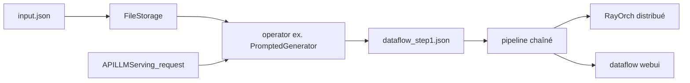

# OpenDCAI/DataFlow

> Système d'opérateurs pour générer, nettoyer, évaluer et filtrer des données d'entraînement LLM.

## Le problème
Préparer un corpus d'entraînement depuis des PDF et des QA bruités est un travail artisanal, non reproductible, et impossible à comparer d'une stratégie à l'autre.

## Ce que ça fait vraiment
Conception par `operator` : chaque opérateur prend du JSON, JSONL ou CSV, écrit sa sortie dans une colonne, et se compose en `pipeline` réutilisable.
Pipelines prêts à l'emploi : Text (extraction de QA depuis du texte brut), Reasoning (chain-of-thought, classification, difficulté), Text2SQL, nettoyage de base de connaissances, Agentic RAG.
Un agent DataFlow analyse les données, écrit des opérateurs et assemble des pipelines selon l'objectif.
Suite associée : Skills, WebUI visuelle, Ecosystem pour l'enregistrement d'opérateurs, RayOrch pour l'orchestration distribuée.

## Comment c'est branché


## Essayer
```shell
pip install uv
uv pip install open-dataflow
dataflow -v
dataflow webui
docker pull molyheci/dataflow:cu124
```

## Coût et pièges
Les opérateurs de génération appellent un LLM : `export DF_API_KEY=sk-xxx`, facture à ta charge. L'inférence locale passe par `open-dataflow[vllm]` et donc un GPU ; l'image Docker embarque CUDA 12.4.1 et vLLM. Python 3.10 à 3.12.

## Ce que ce n'est pas
Pas un dataset : c'est l'outillage qui en produit. Pas un framework d'entraînement : il prépare les données, l'entraînement se fait ailleurs (LLaMA-Factory, Megatron-DeepSpeed dans leurs expériences). Les gains annoncés viennent de leurs propres benchmarks sur leurs propres jeux.

## Alternatives
Infinity-Instruct, Open-R1, Synthetic-1, Code Alpaca, Self-OSS — les jeux de données de comparaison des tableaux, pas des frameworks concurrents.

## Pour toi
Le plus proche d'une chaîne de préparation de données LLM reproductible ; le modèle Pipeline → Operator → Prompt est directement réutilisable.
