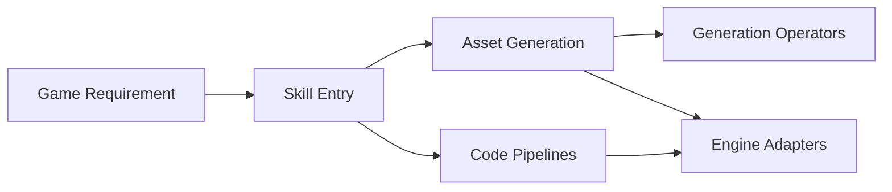

# OpenDCAI/GameFactory-3A

> Cadre de compétences d'agent qui génère assets, code de jeu et vidéos pour UE5, Unity, Godot, Blender et three.js.

## Le problème
Produire un jeu demande des assets 3D, du mouvement, du son et du code moteur que personne ne coordonne automatiquement.

## Ce que ça fait vraiment
Un agent de code (Codex, Claude Code, Gemini CLI) lit `agent_skills/setting_overview.md`, puis appelle des pipelines : images, objets et scènes 3D, mouvement, audio, vidéo CG, mécaniques de jeu et interface. Des adaptateurs couvrent cinq moteurs. Les démos citent Meshy, Hunyuan3D, Mixamo, Puppeteer et MoMask.

## Comment c'est branché


## Essayer
```bash
# Dans un agent de code (Codex, Claude Code…) :
cd GameFactory-3A
# puis demander de lire agent_skills/setting_overview.md avant de décrire le jeu voulu
```

## Coût et pièges
Modèles locaux lourds (GPU) ou API cloud payantes (Meshy, Seedance cités). Chaque moteur à installer. Le README ne chiffre ni VRAM ni coût.

## Ce que ce n'est pas
Pas un générateur de jeu en un clic : le résultat dépend de l'agent. Les démos mêlent assets générés et assets libres ou de bibliothèques.

## Alternatives
Aucune alternative nommée dans le README.

## Pour toi
À surveiller : intéressant comme exemple d'orchestration agent + pipelines de génération multimodale, mais lourd et très récent (juillet 2026).

