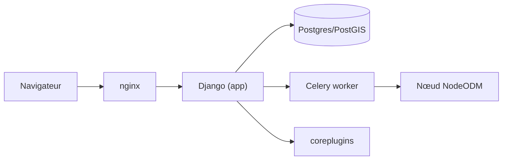

# OpenDroneMap/WebODM

> Application web qui transforme des photos de drone en cartes, nuages de points et modèles 3D, pour cartographes.

## Le problème
Traiter des images aériennes (géoréférencement, MNT, modèles texturés) demande des moteurs lourds et une chaîne d'outils que l'on ne veut pas piloter à la main.

## Ce que ça fait vraiment
Une application Django avec interface web : on crée un projet, on envoie des images, une tâche Celery est mise en file et déléguée à un nœud de traitement (NodeODM, ODX, MicMac, LGT) via une API REST. Les résultats (orthophoto, nuage de points, modèle 3D, splats gaussiens) reviennent dans l'interface. Un cadre de plugins (`coreplugins`) étend l'ensemble.

## Comment c'est branché


## Essayer
```bash
# Commande non documentée dans l'extrait du README :
# installateurs officiels et documentation via les liens Download / Documentation.
```

## Coût et pièges
Le traitement photogrammétrique réclame beaucoup de RAM et de CPU (page « Hardware Requirements »). Le README avertit : depuis avril 2026 des installateurs payants tiers circulent, ce ne sont pas les officiels.

## Ce que ce n'est pas
Ce n'est plus une interface d'OpenDroneMap : le projet s'en est officiellement dissocié et utilise ODX, pas ODM. La licence AGPL impose de publier les modifications d'un service exposé en réseau.

## Alternatives
- ODX / NodeODM : le moteur seul, si l'interface web est superflue.
- MicMac : autre moteur pris en charge, pour des besoins spécifiques.

## Pour toi
À surveiller : utile si tu traites de l'imagerie aérienne, mais sans rapport direct avec un profil data/IA/MLOps et la dissociation récente d'OpenDroneMap change l'écosystème.

