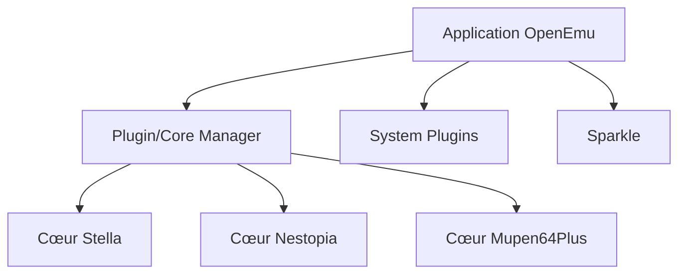

# OpenEmu/OpenEmu

> Interface macOS native pour jouer avec de nombreux émulateurs de consoles, via des plugins de cœurs.

## Le problème
Chaque émulateur a sa propre interface, ses réglages et ses formats ; sur Mac ils s'intègrent mal au système.

## Ce que ça fait vraiment
Frontal Cocoa/Metal/Core Animation qui charge des cœurs d'émulation en plugins (Stella, mGBA, Dolphin, Mupen64Plus, Mednafen, Snes9x, etc.) couvrant plus de 30 systèmes, de l'Atari 2600 à la GameCube. Sparkle gère les mises à jour ; UniversalDetector et XADMaster aident à l'import de ROMs. Il faut macOS Mojave 10.14.4 pour l'exécuter et Xcode 14.3 avec Ventura pour compiler.

## Comment c'est branché

## Essayer
Le README fourni ne contient aucune commande.

## Coût et pièges
Gratuit. Aucune licence n'est déclarée dans le catalogue : droits de réutilisation inconnus. Les ROMs et BIOS sont à obtenir légalement.

## Ce que ce n'est pas
Ce n'est pas un émulateur en soi : il assemble des cœurs tiers, chacun sous sa propre licence.

## Alternatives
Le README ne cite pas d'alternative.

## Pour toi
À ignorer : outil de jeu macOS, sans licence claire et sans rapport avec ton métier.

