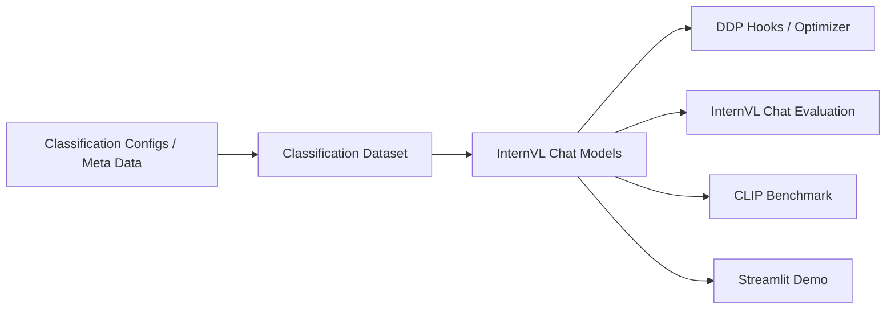

# OpenGVLab/InternVL

> Famille de modèles multimodaux vision-langage ouverts (1B à 241B) avec code d'entraînement et d'évaluation.

## Le problème
Les meilleurs modèles vision-langage sont fermés ; il faut des alternatives ouvertes pour chat multimodal, OCR, retrieval ou fine-tuning.

## Ce que ça fait vraiment
Publie InternVL 1.0 à 3.5 : MLLM (InternViT + LLM Qwen/InternLM), encodeurs InternViT, modèles type CLIP (InternVL-C/G).
Chat texte, image unique, multi-images, vidéo, inférence par lots via `AutoModel` Hugging Face (`trust_remote_code`).
Code de fine-tuning (LoRA, MPO), évaluation, classification, segmentation, benchmarks CLIP, démo Streamlit.
Deux formats de checkpoints (GitHub et HF) avec scripts de conversion.

## Comment c'est branché

## Essayer
Aucune commande shell dans le README ; uniquement des exemples Python via `transformers.AutoModel.from_pretrained('OpenGVLab/InternVL2_5-8B', trust_remote_code=True)`.

## Coût et pièges
Gratuit, MIT. Le 8B tient sur une A100 80 Go selon le README, les plus gros exigent du multi-GPU. `trust_remote_code` exécute du code distant. Dernier push septembre 2025.

## Ce que ce n'est pas
Pas encore intégré à vLLM/Ollama selon la TODO list. Le titre « alternative à GPT-5 » est marketing.

## Alternatives
Aucune nommée dans le README (comparaisons chiffrées à OpenCLIP, EVA-CLIP, ViT-22B).

## Pour toi
À surveiller : les petites tailles (1B-8B) sont de bonnes bases VLM à fine-tuner pour de l'OCR ou du document, mais le dépôt ralentit depuis 2025.
