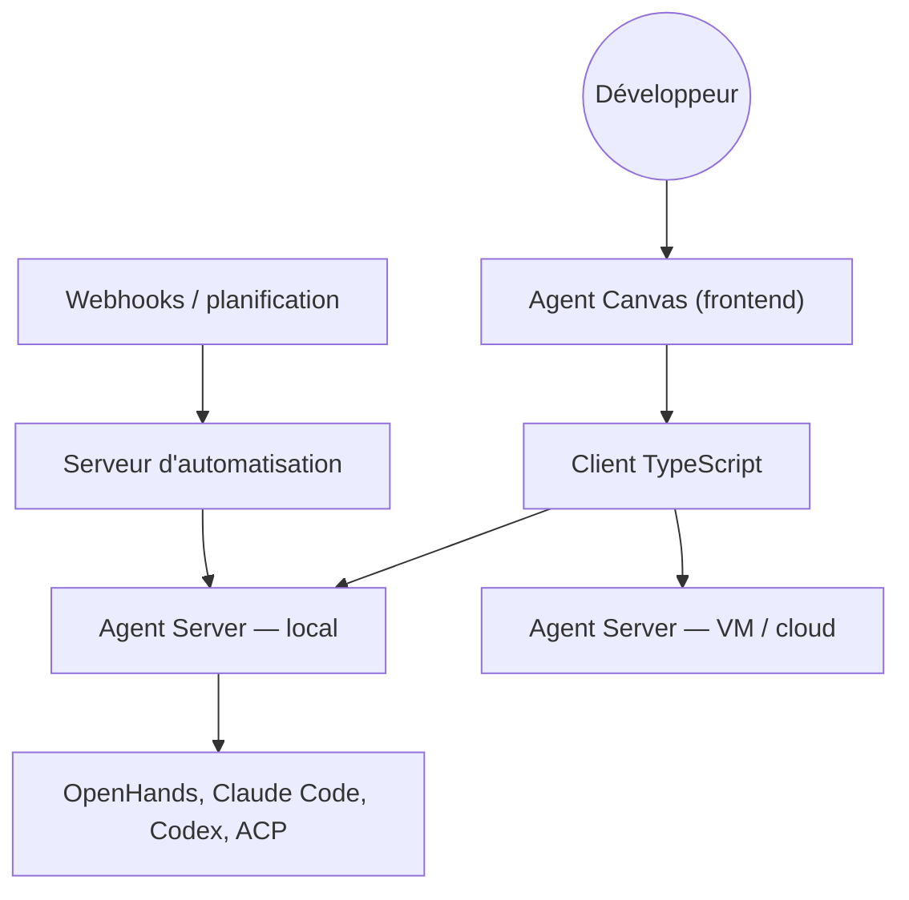

# OpenHands/OpenHands

> Centre de contrôle auto-hébergé pour lancer et automatiser des agents de code, quel que soit l'agent.

## Le problème
Les agents de code vivent chacun dans son terminal, sur une seule machine, sans planification.
Rien ne permet de basculer entre un agent local et un agent distant sans perdre le fil.

## Ce que ça fait vraiment
Agent Canvas démarre des conversations et des automatisations, et se connecte à plusieurs backends d'agents.
Exécute OpenHands, Claude Code, Codex, Gemini ou tout agent parlant Agent-Client Protocol (ACP).
Automatisations déclenchées par planification ou par webhook, intégrées à Slack, GitHub, Linear, Notion.
Repose sur l'Agent Server, une API REST qui fait tourner plusieurs agents sur un hôte.

## Comment c'est branché


## Essayer
```sh
npm install -g @openhands/agent-canvas
agent-canvas
docker run -it --rm -p 8000:8000 -v "$HOME/.openhands:/home/openhands/.openhands" -v "${PROJECTS_PATH}:/projects" ghcr.io/openhands/agent-canvas:1.20.0
```

## Coût et pièges
Le produit est libre ; les modèles sont à ta charge, et une offre Cloud/Enterprise existe.
Sans sandbox (options 1 et 3), l'agent-server a **un accès complet au système de fichiers** de la machine.

## Ce que ce n'est pas
Pas un agent : c'est une console qui pilote des agents écrits ailleurs.
Le code est réparti sur quatre dépôts — le SDK, le client TypeScript et l'automatisation vivent hors de celui-ci.
Pas sécurisé par défaut pour une exposition réseau ; le README renvoie à `SELF_HOSTING.md` pour le durcissement.

## Alternatives
- `bytedance/deer-flow` : orchestration de sous-agents et de sandboxes, pensée comme un harnais unique.
- `NousResearch/hermes-agent` : agent permanent auto-hébergé, sans console multi-backends.

## Pour toi
Pertinent si tu fais tourner plusieurs agents sur un serveur ; l'option sans sandbox est à écarter.
