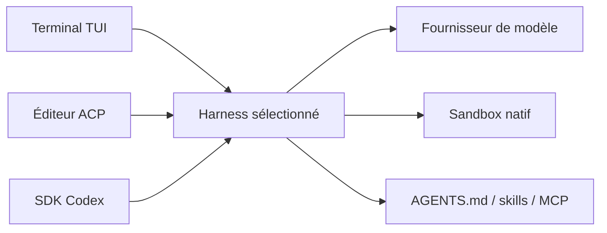

# OpenInterpreter/open-interpreter

> Agent de code en terminal, réécrit en Rust à partir de Codex, qui imite les « harness » d'autres agents.

## Le problème
Les modèles peu coûteux rendent mal dans un agent conçu pour un autre modèle. Changer de fournisseur ou d'éditeur oblige à changer d'outil.

## Ce que ça fait vraiment
Fork de Codex d'OpenAI, il propose `/harness` pour émuler la boucle d'agent d'autres outils (claude-code, kimi-code, qwen-code, swe-agent, minimal…). Il change de modèle avec `/model`, exécute les commandes dans un sandbox natif (macOS, Linux, Windows), parle ACP pour les éditeurs et réutilise `AGENTS.md`, `.agents/skills` et MCP. Il embarque une compétence QA pour tester des interfaces web ou natives.

## Comment c'est branché
Le diagramme fourni décrit l'ancienne version Python (LiteLLM, FastAPI) et ne correspond plus au README Rust ; schéma tiré du README :


## Essayer
```bash
curl -fsSL https://www.openinterpreter.com/install | sh
interpreter
```

## Coût et pièges
Il faut des identifiants d'un fournisseur de modèle (documentés ailleurs, non lus). Le script d'installation est un `curl | sh`. Coût des jetons à ta charge.

## Ce que ce n'est pas
Pas le projet Python d'origine : celui-ci vit dans un fork communautaire (endolith/open-interpreter). Le diagramme d'architecture fourni est périmé. Gouvernance non précisée dans le README.

## Alternatives
Codex d'OpenAI (dont c'est un fork) ; endolith/open-interpreter pour la version Python d'origine.

## Pour toi
À surveiller : intéressant pour tester des modèles bon marché dans plusieurs harness, mais le projet a changé de nature et l'installation par script demande de la prudence.
