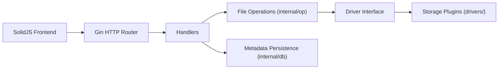

# OpenListTeam/OpenList

> Serveur web qui liste et partage des fichiers stockés sur de nombreux disques réseau et clouds.

## Le problème
Les fichiers sont répartis entre plusieurs stockages (cloud personnel, S3, FTP, WebDAV…), sans interface unique pour les parcourir.

## Ce que ça fait vraiment
Agrège plus de 40 stockages (Aliyundrive, OneDrive, Google Drive, S3, WebDAV, SMB, etc.) derrière une interface web : aperçu de fichiers, galerie, vidéo/audio, documents Office, téléversement, téléchargement hors ligne, copie entre stockages, mode sombre. D'après le code : backend Go/Gin, frontend SolidJS, une couche `drivers/` par stockage et une base SQL de métadonnées. Le README précise qu'il ne fait que des redirections 302 ou du transfert de trafic.

## Comment c'est branché

## Essayer
Aucune commande documentée dans le README fourni ; le README renvoie à la documentation en ligne.

## Coût et pièges
Gratuit, mais dépend des comptes tiers (blocages de compte ou limites de débit à ta charge, dit le README). AGPL-3.0 : obligation de publier les modifications servies en réseau. Attention aux dérivés portant un nom proche.

## Ce que ce n'est pas
Ce n'est pas un outil de synchronisation ni de sauvegarde. Il n'est affilié à aucun fournisseur de stockage.

## Alternatives
Aucune alternative nommée dans le README (le code est présenté comme un fork d'alist).

## Pour toi
Ignorer pour un profil data/IA : outil de partage de fichiers personnels, sans lien avec ton métier ; l'AGPL complique de plus tout usage en entreprise.

