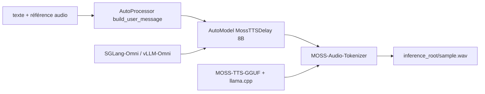

# OpenMOSS/MOSS-TTS

> Famille de modèles ouverts de synthèse vocale : narration longue, dialogue, temps réel, bruitages.

## Le problème
Un seul modèle TTS tient rarement la longueur, le clonage de voix et le dialogue multi-locuteurs.
On finit par empiler trois modèles incompatibles.

## Ce que ça fait vraiment
Cinq modèles séparés : MOSS-TTS (clonage zéro-shot, contrôle pinyin/phonème/durée), MOSS-TTSD (dialogue),
MOSS-VoiceGenerator (voix conçue depuis un texte, sans référence), MOSS-TTS-Realtime (TTFB annoncé 180 ms),
MOSS-SoundEffect (effets sonores). Deux architectures : `MossTTSDelay` et `MossTTSLocal`, plus `MossTTSRealtime`.
Un chemin d'inférence sans PyTorch via llama.cpp et ONNX Runtime, et le service via SGLang-Omni ou vLLM-Omni.

## Comment c'est branché


## Essayer
```bash
git clone https://github.com/OpenMOSS/MOSS-TTS.git
cd MOSS-TTS
uv venv --python 3.12 .venv
source .venv/bin/activate
uv pip install --torch-backend cu128 -e ".[torch-runtime]"
```

## Coût et pièges
GPU CUDA attendu (`torch==2.9.1+cu128` épinglé) ; ffmpeg requis par `torchcodec`.
Le modèle phare fait 8B : compter la VRAM, ou passer par le profil GGUF/ONNX pour une machine modeste.

## Ce que ce n'est pas
Pas un service prêt à l'emploi : il faut télécharger les poids et monter son propre serveur.
Pas un unique modèle — choisir la bonne variante fait partie du travail.
Les moteurs TensorRT ne sont pas fournis : ils se construisent sur ta machine.

## Alternatives
CosyVoice3, FishAudio-S1, DiTAR et Seed-TTS, cités comme comparaisons dans l'évaluation Seed-TTS-eval.

## Pour toi
La famille ouverte à tester si tu as un besoin TTS sérieux et une carte correcte ; sinon trop lourd.
