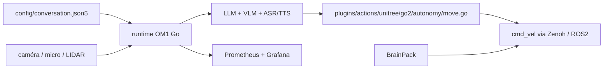

# OpenMind/OM1

> Runtime modulaire pour agents IA multimodaux sur robots et environnements simulés, pour roboticiens.

## Le problème
Recâbler perception, LLM et actions pour chaque forme physique de robot est du travail jeté.
Passer d'un quadrupède à un humanoïde suppose de tout reconfigurer.

## Ce que ça fait vraiment
Runtime Go (le Python est déprécié et non maintenu) : entrées web, réseaux sociaux, caméra, LIDAR ;
sorties mouvement, navigation autonome, conversation. Plugins matériels vers ROS2, Zenoh et CycloneDDS
(Zenoh recommandé). Endpoints préconfigurés TTS et LLM (OpenAI, xAI, DeepSeek, Anthropic, Meta, Gemini,
NearAI, Ollama local) et plusieurs VLM. Stack Prometheus + Grafana fournie pour les latences LLM et ASR.
Agents décrits en fichiers `json5` combinant `inputs` et `actions` ; connecteurs sous `plugins/actions/`.
Autonomie complète (navigation, SLAM, recharge, anonymisation de visages) avec le BrainPack, sur
Unitree Go2/G1, Deep Robotics M20 Pro et LimX Tron. Gazebo et Isaac Sim supportés.

## Comment c'est branché


## Essayer
```bash
sudo apt-get install -y portaudio19-dev ffmpeg pkg-config
export OM_API_KEY="<your_api_key>"
./om1 -config ./config/conversation.json5
git clone https://github.com/OpenMind/OM1.git && make deps && make build
CONFIG=conversation make run
docker-compose up -d grafana prometheus
```

## Coût et pièges
Clé API OpenMind obligatoire ; la facturation se fait en OMCU, plan gratuit à 50 OMCU par mois renouvelé.
Le runtime Go ne couvre pas encore tout ce que faisait le Python. Build depuis les sources : Go 1.25+.
Sur macOS, Gatekeeper et les autorisations micro/caméra à débloquer à la main.

## Ce que ce n'est pas
Ce n'est pas une couche d'abstraction matérielle : OM1 suppose que le robot fournit déjà un SDK
haut niveau acceptant des commandes comme `move(0.37, 0, 0)`. Sans HAL, il faut la construire
(RL, simulation, VLA) — le README le dit explicitement. Ce n'est pas hors ligne : la clé API est un passage obligé.

## Alternatives
Le SDK C++ d'Unitree, cité comme exemple de HAL humanoïde avancé.

## Pour toi
Pertinent seulement si tu touches à de la robotique ; le triptyque Zenoh + json5 + Grafana est bien vu.
