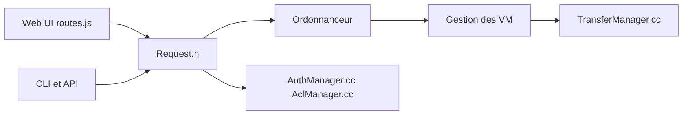

# OpenNebula/one

> Plateforme de gestion de cloud privé, edge et hybride pour machines virtuelles, Kubernetes et charges GPU.

## Le problème
Exploiter une infrastructure de machines virtuelles et de clusters sur plusieurs sites demande un plan de contrôle unifié, avec quotas et haute disponibilité.

## Ce que ça fait vraiment
Un plan de contrôle en C++ : requêtes via interface web, CLI ou API REST/RPC, ordonnancement, cycle de vie des VM, transferts de stockage, datastores et images, surveillance des hôtes, marketplace d'appliances, clusters Kubernetes, fédération et haute disponibilité (Raft), authentification, ACL et quotas. Le README annonce aussi un volet « AI Factory » pour les charges GPU, sans détail technique.

## Comment c'est branché

## Essayer
Aucune commande dans le README : il renvoie à miniONE (déploiement sur un seul serveur) et aux guides d'installation de la documentation officielle.

## Coût et pièges
Gratuit, mais l'installation de production passe par des serveurs dédiés et la documentation externe. 771 issues ouvertes. Le volet « AI Factory » n'est pas détaillé dans ce texte.

## Ce que ce n'est pas
Pas un outil d'orchestration de conteneurs seul ni un service géré : tu exploites toi-même la plateforme. Pas une plateforme MLOps : le support GPU est décrit en une ligne.

## Alternatives
Aucune alternative nommée dans le README (il mentionne un usage de remplacement de VMware sans nommer d'outil).

## Pour toi
Ignorer : plateforme d'infrastructure lourde pour des équipes d'exploitation, bien au-delà d'un besoin data/IA ordinaire.

