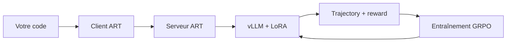

# OpenPipe/ART

> Harnais Python pour entraîner par renforcement (GRPO) des agents LLM multi-étapes déjà écrits.

## Le problème
Un agent LLM qui échoue sur une tâche métier ne s'améliore pas : on ne peut que réécrire le prompt.
Monter une boucle RL maison suppose vLLM, LoRA, gestion GPU et orchestration du rollout.

## Ce que ça fait vraiment
Sépare un **client** compatible OpenAI (dans votre code) et un **serveur** qui tourne sur une machine GPU.
Le client joue des rollouts agentiques ; chaque message est stocké dans une `Trajectory` à laquelle vous
attribuez un `reward`. Les trajectoires sont groupées et envoyées au serveur, qui entraîne en GRPO depuis
le dernier checkpoint, sauve le LoRA et le recharge dans vLLM. Un backend serverless W&B évite le GPU local.

## Comment c'est branché


## Essayer
```bash
pip install openpipe-art
```

## Coût et pièges
Le serveur exige un GPU, local ou éphémère. Le mode « Serverless RL » passe par W&B Training et demande
une `api_key` W&B : facture à votre charge, et dépendance à un service tiers.

## Ce que ce n'est pas
Pas un framework d'agents : ART s'insère dans une application existante, il ne la structure pas.
Pas un service d'inférence prêt à l'emploi. Les gains annoncés (40 % de coût, 28 % de vitesse) portent
sur l'offre commerciale W&B, pas sur ART lui-même. Aucune licence n'est indiquée dans le README.

## Alternatives
- **trl** : bibliothèque RLHF plus généraliste, citée comme inspiration.
- **Unsloth** : fine-tuning efficace sans la boucle agentique.
- **torchtune** : entraînement PyTorch natif, sans harnais d'agent.

## Pour toi
À regarder si tu as déjà un agent en prod avec une fonction de récompense mesurable ; sinon trop tôt.
