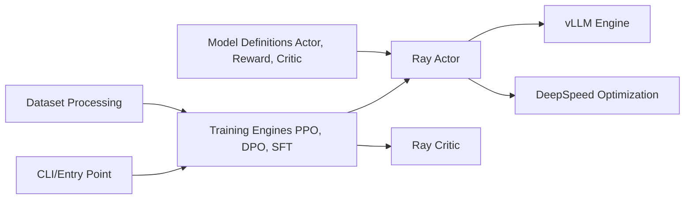

# OpenRLHF/OpenRLHF

> Framework d'entraînement RLHF distribué (Ray + vLLM + DeepSpeed) : SFT, reward model, PPO, GRPO, DPO.

## Le problème
Aligner un LLM par renforcement exige de coordonner acteur, critique, récompense et référence sur plusieurs GPU, avec une génération d'échantillons qui domine le temps de calcul.

## Ce que ça fait vraiment
Ray répartit les modèles sur les GPU ; vLLM génère les rollouts ; DeepSpeed ZeRO-3 entraîne ; checkpoints compatibles Hugging Face.
Algorithmes : PPO, REINFORCE++, GRPO, Dr. GRPO, RLOO, FlashREINFORCE ; plus SFT, DPO/IPO, reward model.
Exécution par agents token-in-token-out : single-turn avec `reward_func` Python custom, multi-turn avec `reset/step`, serveur compatible OpenAI.
Hybrid Engine colocalisé, mode async, LoRA/QLoRA, VLM, MoE, packing, logs W&B/TensorBoard.

## Comment c'est branché


## Essayer
```bash
docker run --runtime=nvidia -it --rm --shm-size="10g" --cap-add=SYS_ADMIN \
  -v $PWD:/openrlhf nvcr.io/nvidia/pytorch:26.03-py3 bash
pip install openrlhf[vllm]
ray start --head --node-ip-address 0.0.0.0 --num-gpus 8
deepspeed --module openrlhf.cli.train_sft --data.dataset Open-Orca/OpenOrca ...
```

## Coût et pièges
Gratuit, Apache-2.0 ; exemples calibrés sur 8x A100 80 Go. Le mode async gagne en débit au prix de la stabilité de convergence.

## Ce que ce n'est pas
Pas un outil pour petit GPU unique ni une API d'alignement managée. Les formules « le premier » et « production-ready » viennent du README.

## Alternatives
Aucune nommée dans le README (Molt est un backend interne).

## Pour toi
À adopter si tu fais du post-training : la `reward_func` custom rend le RLVR (maths, code, format) accessible sans reward model, avec une pile Ray/vLLM standard.
