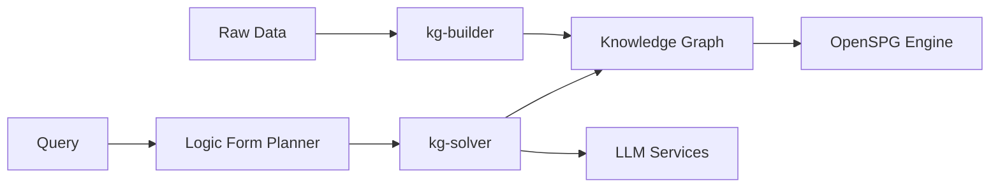

# OpenSPG/KAG

> Framework de questions-réponses et raisonnement logique sur graphe de connaissances, basé sur OpenSPG et un LLM.

## Le problème
Le RAG vectoriel se trompe sur les questions multi-sauts et logiques ; GraphRAG introduit du bruit via l'extraction OpenIE.

## Ce que ça fait vraiment
Deux parties : `kg-builder` construit un graphe métier contraint par schéma, avec index mutuel entre nœuds du graphe et morceaux de texte d'origine ; `kg-solver` traduit une question en forme logique puis combine opérateurs de planification, raisonnement et récupération (correspondance exacte, texte, calcul numérique, raisonnement sémantique). Livré en mode produit (interface web via Docker Compose) ou boîte à outils Python. `kag-model` n'est pas encore publié.

## Comment c'est branché

(Diagramme fourni sans composant lisible : nœuds tirés de l'explication.)

## Essayer
```bash
curl -sSL https://raw.githubusercontent.com/OpenSPG/openspg/refs/heads/master/dev/release/docker-compose-west.yml -o docker-compose-west.yml
docker compose -f docker-compose-west.yml up -d
```

## Coût et pièges
Docker et Docker Compose requis pour le moteur OpenSPG ; LLM à ta charge. Identifiants par défaut `openspg` / `openspg@kag` à changer.

## Ce que ce n'est pas
Pas un RAG léger à brancher en une ligne : il faut modéliser un schéma et faire tourner tout le moteur OpenSPG.

## Alternatives
Aucune alternative nommée ; RAG et GraphRAG sont cités comme approches comparées, pas comme dépôts.

## Pour toi
À surveiller si tu as un corpus métier très structuré où le RAG vectoriel échoue ; sinon le coût de mise en place (schéma, moteur complet) dépasse le gain.
