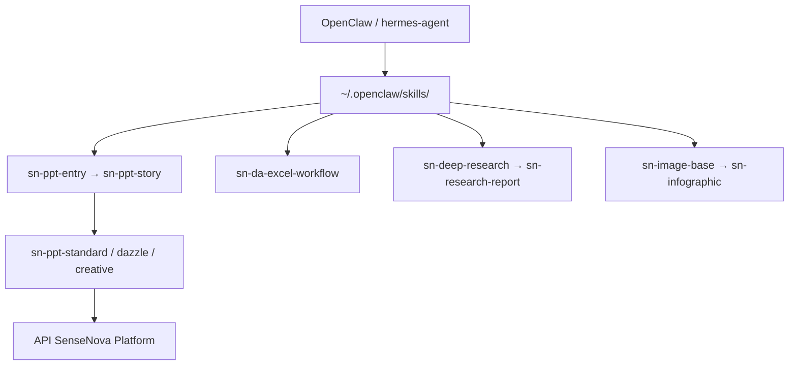

# OpenSenseNova/SenseNova-Skills

> Collection de skills bureautiques pour agents : infographies, decks, Excel, deep research.

## Le problème
Un agent généraliste sait rédiger, pas produire un deck conforme, une infographie dense ou une analyse Excel multi-feuilles reproductible.
Chaque équipe réécrit ces chaînes à sa façon.

## Ce que ça fait vraiment
Chaque skill vit dans son répertoire avec un `SKILL.md` déclarant déclencheurs, capacités et flux d'exécution, selon la convention Agent Skills.
La chaîne PPT est explicite : `sn-ppt-entry` collecte rôle, audience, nombre de pages et mode, `sn-ppt-story` produit l'`outline.md` obligatoire, puis mode standard (HTML par page + revue VLM + export PPTX), dynamique ou créatif.
`sn-da-excel-workflow` couvre la lecture multi-feuilles, la détection de gros fichiers (≥10k lignes → Parquet), le nettoyage, l'agrégation inter-feuilles et l'export.
`sn-deep-research` planifie des lots de recherche parallèles, réconcilie les chiffres contradictoires entre sources et produit un `report.md` avec citations numérotées.

## Comment c'est branché


## Essayer
```bash
git clone https://github.com/OpenSenseNova/SenseNova-Skills.git --depth=1
mkdir -p ~/.openclaw/skills
cp -r SenseNova-Skills/skills/* ~/.openclaw/skills/
```
Le README recommande plutôt de demander à l'agent d'installer lui-même, puis de redémarrer le service.

## Coût et pièges
Les skills sont gratuites mais appellent l'API SenseNova : clé, base URL et nom de modèle doivent venir de la même région (international ou Chine continentale), sous peine de 400/401.
Des dépendances Python par catégorie, Playwright et Chromium sont nécessaires pour le rendu et l'export PPTX ; un skill « doctor » existe par famille pour les vérifier.

## Ce que ce n'est pas
Ce n'est pas un agent ni un modèle : ce sont des instructions et des scripts qui supposent un runtime Agent Skills.
Ce n'est pas neutre non plus — une part du README vend Raccoon, le produit intégré, et les entrées « third-party quick try » sont explicitement hors support.

## Alternatives
- Raccoon : le produit packagé du même éditeur, si tu ne veux pas provisionner env, clés et runtimes.
- OpenClaw ou hermes-agent : les runtimes recommandés, à choisir avant les skills.

## Pour toi
La chaîne data → recherche → deck est bien découpée et vaut la lecture, même si tu ne branches jamais l'API SenseNova.
