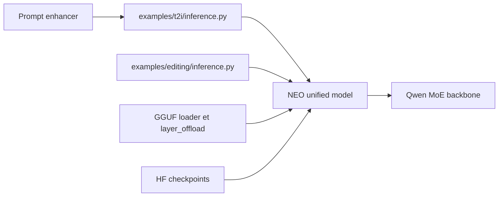

# OpenSenseNova/SenseNova-U1

> Famille de modèles multimodaux unifiés (génération et édition d'images, texte entrelacé, compréhension visuelle).

## Le problème
Les systèmes multimodaux assemblent souvent encodeur visuel, VAE et adaptateurs ; l'auteur veut un seul modèle natif, de pixel à mot.

## Ce que ça fait vraiment
Architecture NEO-unify sans encodeur visuel ni VAE. Le dépôt fournit des scripts d'inférence (texte→image, édition, génération entrelacée, VQA), un enrichissement optionnel de prompt, un chargement GGUF et un déchargement de couches pour GPU modestes, un plugin ComfyUI, le code d'entraînement distribué et les évaluations. Sortie U1.5-8B-MoT ; limites reconnues (texte dense, mains, dérive en édition).

## Comment c'est branché


## Essayer
```bash
python examples/t2i/inference.py \
  --model_path sensenova/SenseNova-U1.5-8B-MoT \
  --prompt "A formal portrait depicts a man in 18th-century attire" \
  --output output.png
```

## Coût et pièges
GPU nécessaire : le mode `--vram_mode` et le GGUF Q4 visent 10 à 12 Go. Le serving recommandé (LightLLM + LightX2V) est annoncé sur H100/H200 ; les poids GGUF U1.5 « Lite » sont « bientôt » disponibles.

## Ce que ce n'est pas
Pas un service prêt à l'emploi : le README renvoie aussi vers un studio en ligne gratuit. Les GGUF communautaires ne sont pas maintenus par l'équipe officielle.

## Alternatives
LightLLM et LightX2V pour le serving ; SenseNova-Skills (OpenClaw) pour l'intégration en agent.

## Pour toi
À surveiller : modèle ouvert Apache-2.0 intéressant pour la génération et l'édition d'images en local, à évaluer sur ton GPU avant tout engagement.

