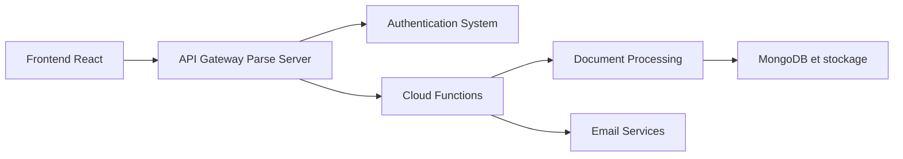

# OpenSign

> Alternative libre à DocuSign : signature électronique de PDF, auto-hébergeable, pour équipes qui signent des contrats.

## Le problème
Les services de signature électronique du commerce facturent par usage et gardent les documents chez un tiers.

## Ce que ça fait vraiment
Signature de PDF (dessinée, image, saisie), multi-signataires avec ordre imposé, code OTP par e-mail pour les invités, expiration et rejet, modèles, coffre « Drive », journal d'audit et certificat de complétion, API et intégrations (Zapier). Architecture : front React, serveur Parse Server, MongoDB, stockage de fichiers compatible S3.

## Comment c'est branché


## Essayer
```bash
export HOST_URL=https://opensign.yourdomain.com && curl --remote-name-all https://raw.githubusercontent.com/OpenSignLabs/OpenSign/main/docker-compose.yml https://raw.githubusercontent.com/OpenSignLabs/OpenSign/main/Caddyfile https://raw.githubusercontent.com/OpenSignLabs/OpenSign/main/.env.local_dev && mv .env.local_dev .env.prod && docker compose up --force-recreate
```

## Coût et pièges
Docker et git requis. La base MongoDB par défaut n'est pas persistante et s'efface à chaque redémarrage : fournir sa propre URL. Une version cloud gratuite existe. Licence présente mais non identifiée par GitHub.

## Ce que ce n'est pas
Pas une valeur juridique garantie par le README : il ne dit rien sur la conformité (eIDAS, etc.).

## Alternatives
DocuSign, PandaDoc, SignNow, Adobe Sign, HelloSign, Zoho Sign : les offres commerciales que le README cite comme point de comparaison.

## Pour toi
À surveiller : sert si tu dois signer des documents en interne sans SaaS, mais hors cœur data/IA, et la licence est à confirmer.

