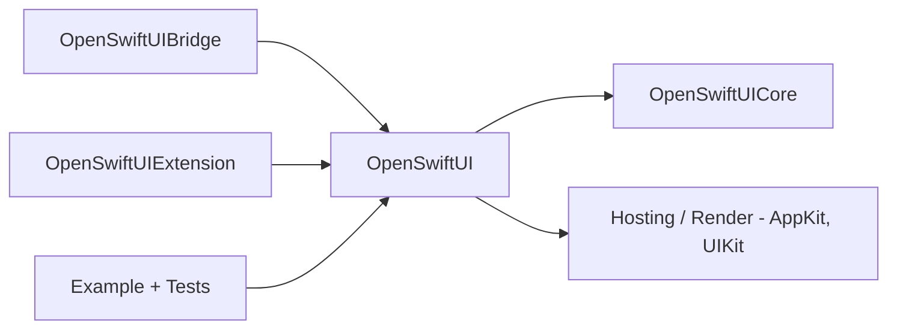

# OpenSwiftUIProject/OpenSwiftUI

> Réimplémentation ouverte de SwiftUI pour bâtir des interfaces hors Apple et diagnostiquer SwiftUI.

## Le problème
SwiftUI est propriétaire et limité aux plateformes Apple ; le comportement interne est difficile à déboguer.

## Ce que ça fait vraiment
Il vise une compatibilité de source avec l'API SwiftUI. `OpenSwiftUICore` est le moteur (animation, disposition, rendu), `OpenSwiftUI` la couche d'API, `OpenSwiftUIBridge` sert à migrer d'autres DSL, `OpenSwiftUIExtension` ajoute des API. Des couches d'intégration (AppKit, UIKit) hébergent le rendu. Le README précise que le projet est en développement précoce et utilise beaucoup d'API privées Apple.

## Comment c'est branché


## Essayer
```bash
./Scripts/build
./Scripts/openswiftui_swiftinterface
Scripts/preview-documentation.sh
```

## Coût et pièges
Chaîne recommandée : Swift 6.3.3 / Xcode 26.6. La configuration passe par de nombreuses variables d'environnement. Cloner OpenAttributeGraph à côté pour l'exemple. Ne pas l'utiliser en production sur les plateformes Apple (API privées, risque de casse à chaque mise à jour).

## Ce que ce n'est pas
Ce n'est pas un SwiftUI complet ni supporté par Apple. Le README indique un usage d'apprentissage et de recherche, à vos risques.

## Alternatives
Aucune alternative nommée dans le README.

## Pour toi
À ignorer : projet d'interface Swift expérimental, sans rapport avec la data, l'IA ou le MLOps.

